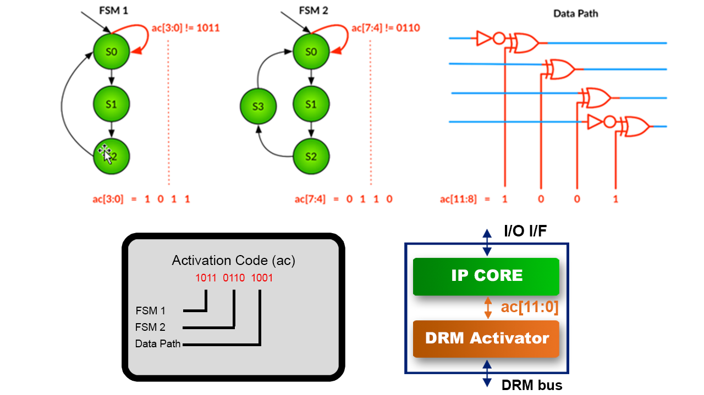

========================
DRM Hardware integration
========================

This section gives the main steps to generate a bitstream including the DRM
controller and the protection blocks (DRM Activators) to integrate in the FPGA design.

.. note:: When the bitstream is loaded in the FPGA board, the design is initially locked.
          The Accelize DRM library is then required to unlock the design with
          a valid license. See :doc:`drm_library_integration` for more information.

More details about DRM Controller and Activator logics can be found here:

- :doc:`drm_hardware_ip_controller`.
- :doc:`drm_hardware_ip_activator`.

You can also follow this :doc:`drm_hardware_ipi_guidelines`.

Supported hardware
==================

Here are the FPGA vendors, families and EDA tools that are
currently supported by the DRM HDK:

.. list-table::
   :header-rows: 1

   * - Vendor
     - Tools
     - Families
   * - Xilinx(R)
     - * Vivado 2017.4
       * Vivado 2018.2
       * Vivado 2018.2.xdf
       * Vivado 2018.3
       * Vivado 2019.1
       * Vivado 2019.2
     - * Ultrascale+
       * Ultrascale
       * Virtex 7
       * Virtex 6
       * Spartan 6
       * Spartan 3a DSP
       * Spartan 3a
       * Kintex 7
       * Artix 7
   * - Intel(R)
     - * From Quartus Prime Pro Edition 17.1
     - * Cyclone V
       * Arria 10 [#f1]_
       * Arria V GZ
       * Arria V
       * Stratix V
       * Stratix 10

.. warning:: As long as Intel(R) OPAE is not exposing the Chip ID,
             node-locked mode can not be implemented.

.. warning:: As long as IEEE-1735 encryption is supported only on Pro Editions of Quartus,
             only Pro Editions are supported.

Request DRM HDK
===============

Identify how many IP cores must be protected
--------------------------------------------

Identify how many IP cores must be protected (including IP cores that are
already protected by a DRM activator) in your FPGA design. For example,
In the following figure, 7 IP cores must be protected (3 instances of IP core A,
1 instance of IP core B, 2 instances of IP core D, 1 instance of IP core E):

.. image:: _static/Bus-architecture.png
   :target: _static/Bus-architecture.png

You will also need to provide the Vendor-Library-Name-Version (VLNV) information
for each new IP core to protect.

Request DRM HDK from Accelize
-----------------------------

Send a request for a DRM controller and DRM activators to Accelize, with the
following information:

- How many IP cores (including multiple instances of an IP core) must be
  protected
- How many already protected IP cores (and what IP cores) you must reuse
- For each IP core that must be protected and that is not already protected,
  provide a VLNV (Vendor name, Library name, design Name, Version number).
  For multiple instance IP cores, only one VLNV is required.

Receive DRM HDK from Accelize
-----------------------------

A zip file will be sent to you. It is containing the HDK sources with in 3 folders:

- The ``common`` folder: contains the IP common structure for the activator and the controller.

- The ``controller`` folder: contains the controller VHDL top-level and the Verilog Wrapper.
  The controller has the appropriate number of ports: a pair of AXI4-Stream interfaces for each
  IP instance in your design (already protected IPs and IPs to protect).

- The ``controller_sw`` folder: contains the DRM bridge that must be instantited in the Fabric
  when the SW controller application is running on the process core.

- The ``activator`` folder: contains the activator VHDL core and various wrappers for simulation and synthesis.
  A single DRM Activator is delivered per IP core type. Multiple instances of the same IP
  core shall instantiate the same activator as many times.

Contact the support to know how to get the Activation code for your IP. Make sure to keep the Activation Code private.

Considering the previous example, you will receive:

- a DRM Controller IP with 7 ports,
- 1 DRM Activator of IP core A
- 1 DRM Activator of IP core B

Modify your design
==================

Protect the IP cores
--------------------

There are different ways of doing this. In this document we propose to create a wrapper,
in which the DRM Activator and the IP core are instantiated. The original IP core needs
to be slightly modified to include the DRM protection and the
usage measurement logic.
With this approach, managing multiple instances of the same protected IP is built-in.

.. image:: _static/Protected-IP.png
   :target: _static/Protected-IP.png

.. note:: Clock and reset ports of the IP core are not represented on the figure but
          there could have a single or multiple clocks and resets ports.

Create a wrapper
^^^^^^^^^^^^^^^^

The wrapper interface includes the original IP interface, plus the DRM AXI4-Stream interface
used to communicate with the DRM Controller.
Here are the Activator signals that shall be exposed on the wrapper interface
to be later connected to the DRM Controller:

  .. list-table::
     :header-rows: 1

     * - Name
       - Direction
       - Size
       - Description
     * - drm_arstn
       - in
       - 1
       - DRM AXI4-Stream bus Asynchronous Reset (active low)
     * - drm_aclk
       - in
       - 1
       - DRM AXI4-Stream bus Clock domain
     * - drm_to_uip_tready
       - out
       - 1
       - AXI4-Stream Ready signal for DRM Controller to IP Activator Channel
     * - drm_to_uip_tvalid
       - in
       - 1
       - AXI4-Stream Valid signal for DRM Controller to IP Activator Channel
     * - drm_to_uip_tdata
       - in
       - 32
       - AXI4-Stream Data signal for DRM Controller to IP Activator Channel
     * - uip_to_drm_tready
       - in
       - 1
       - AXI4-Stream Ready signal for IP Activator to DRM Controller Channel
     * - uip_to_drm_tvalid
       - out
       - 1
       - AXI4-Stream Valid signal for IP Activator to DRM Controller Channel
     * - uip_to_drm_tdata
       - out
       - 32
       - AXI4-Stream Data signal for IP Activator to DRM Controller Channel

Adapt the original IP
^^^^^^^^^^^^^^^^^^^^^

1. Modify the original IP interface

Add the following ports to the original IP core:

  .. list-table::
     :header-rows: 1

     * - Name
       - Direction
       - Size
       - Description
     * - ip_core_aclk
       - out
       - 1
       - IP Core clock domain
     * - activation_code
       - in
       - 128
       - Expose the Activation Code corresponding the current license key (synchronous to ip_core_aclk)
     * - metering_event
       - out
       - 1
       - A 1 clock cycle pulse (synchronous to ip_core_aclk) increments the Metering data counter

#. Protect relevant code of the original IP

The most critical part is to smartly modify the original IP core so that
piece of the IP internal logic is combined with the activation code bits
provided by the DRM activator signal to enable or disable part or all
of the IP functionality.

The 128 bit activation code is unique and randomly generated by Accelize.
Each IP core has its own activation code.

The 128 bits of the activation code are used to create conditions for IP
activation/deactivation. There are different techniques to instrument the IP code:
individual bit, groups of bits, range of bits can be used in the code to:

- Gate signals,
- Switch FSM states,
- Select functional parts.

For instance, we propose to implement these 3 techniques on the 12 LSBs of
the ACTIVATION_CODE signal as follows:

- 8 bits are used to unlock FSMs transitions
- 4 bits are used to control a Data Path

.. warning:: It is highly recommended to use as much as possible those techniques
             as it increases the protection against reverse engineering attacks.

.. important:: The DRM event and activation ports are synchronized on the ``ip_core_aclk``
             clock. Make sure a clock domain crossing technique is implemented
             when necessary.

#. Add metering logic

Even if you have not planned to monetize your IP based on a "pay-per-use" model, we strongly
encourage to include in your IP core or wrapper some usage measurement logics to gather
anonymously some statistics information about the IP usage: a better understanding of
the actual IP usage might help to propose future solutions that would better
answer your customer needs.

a. First you need to determine which data metrics is the most relevant to count with regard
   to the application domain.
   Typically you would count the number of bytes processed for an encryption IP but
   you would count the number of frames processed for a video rescaling IP.

#. Then instrument your code to measure your metrics. For instance count the number of
   bytes processed.

#. When the metric unit is reached, generate a 1-clock cycle pulse (synchronized on
   ``ip_core_aclk``) on the ``metering_event`` port of the DRM Activator.
   For instance, generate a pulse every 100M bytes.

Each pulse on ``metering_event`` increases the metering 64-bit counter by 1.
The value of this counter is transmitted to the DRM Web Service which converts it
in number of usage units for this particular account.

.. note:: Pay particular attention to the way the IP core drives this
          ``metering_event`` signal as it might be directly related to the business model.
          ``metering_event`` input is level-sensitive and must be de-asserted after each event.

.. warning:: The DRM event is synchronized on the ``ip_core_aclk``
             clock. Make sure a clock domain crossing technique is implemented
             when necessary.

Instantiate the adapted IP core and DRM Activator in the wrapper and connect them
^^^^^^^^^^^^^^^^^^^^^^^^^^^^^^^^^^^^^^^^^^^^^^^^^^^^^^^^^^^^^^^^^^^^^^^^^^^^^^^^^

- Instantiate the DRM Activator IP located in the DRM_HDK/v_l_n_v/syn.
- Connect the signals of the DRM Activator listed by the table in section `Adapt the original IP`_
  to the adapted IP core.
- Connect the DRM bus of the DRM Activator listed by the table in section `Create a wrapper`_
  to the wrapper interface.
- Connect the clock and reset of the adapted IP core to the wrapper interface.

Encrypt the Protected IPs
^^^^^^^^^^^^^^^^^^^^^^^^^

.. warning:: Encrypting the Protected IP is mandatory since it contains the
             activation code in clear text.

Encrypt each protected IP in IEEE 1735 for Vivado or Ampcrypt for Quartus.
Please contact your EDA reseller for more information about IP encryption.

If your environment requires another encryption standard, please contact Accelize_.

Instantiate the Protected IP
----------------------------

Once your IP protected, they can be instantiated once or multiple times in your FPGA design.

Instantiate the DRM Controller IP
---------------------------------

A single DRM Controller must be instantiated in FPGA to interact with multiple
protected IP cores.

- Instantiate the DRM controller IP (located in the DRM_HDK/controller/rtl/syn/) in the design top-level
- Connect the DRM controller AXI4 lite interface to the AXI4 lite Control layer of the design
  top level
- **Remember the offset address of the DRM controller IP in the Control layer of the design for the SW integration**
- Connect each AXI4-stream interfaces of the DRM controller to an AXI4-stream interface of a
  protected IP core.

.. image:: _static/DRM_ENVIRONMENT_TOPOLOGY.png
   :target: _static/DRM_ENVIRONMENT_TOPOLOGY.png

.. warning:: The ``drm_aclk`` clock of the DRM Controller and the DRM Activators
             MUST be the same clock.

.. note:: For SoM platforms, the controller IP is a lightweight bridge IP which has the exact same
          interfaces as the full Controller IP and is responsible for translating the requests from the SW Controller
          running on the TEE of the processor core to the Activator IP in the Fabrics.

.. note:: For SoM platforms, contact `Accelize Support Team <mailto:support@accelize.com>`_ to get the SW Controller Trusted Application.

Simulate your design
====================

.. important:: For SoM platform, there is no simulation application of the SW Controller normally running in the TEE.
               So don't use the Controller SW bridge IP but use the Controller HW IP instead with the BFM enabled (USE_BFM=TRUE, more details below).

Requirements:

- Modelsim >= 17.1
- Vivado >= 2017.4

The user can find a simulation model of the DRM Activator, top_drm_activator_0xVVVVLLLLNNNNVVVV_sim.(sv,vhdl),
in the DRM_HDK/vendor_library_name_version/sim folder.
It instantiates a DRM Controller Bus Functional Model (BFM) in addition to the RTL model of the
DRM Controller and internally implements a mechanism to load a license file, generate signals and
messages for debugging.
This simulation model is specific to each Activator. This is particularly interesting when the
design instantiate multiple Protected IPs. By this mean you can simulate each Protected IP
(IP code + Activator) separately from the rest of the design.

In addition to the simulation top-level, you'll find in the ``sim`` folder the following files:

- xilinx_sim, modelsim (with drm_controller_bfm)     : Each folder contains the BFM core encrypted for the specific tool. The BFM core is instantiated by the top_drm_activator_0xVVVVLLLLNNNNVVVV_sim.
- drm_activator_0xVVVVLLLLNNNNVVVV_sim_pkg.(sv,vhdl) : Package containing simulation parameters (see details below)
- drm_license_package.vhdl                           : Generic license file
- drm_activator_0xVVVVLLLLNNNNVVVV_license_file.xml  : Specific license file

.. image:: _static/RTL-simu.png
   :target: _static/RTL-simu.png

ModelSim Compilation and Simulation
-----------------------------------

.. important:: DRM Controller VHDL source files MUST be compile under "drm_library" library.
               DRM Activator files must compiled in their own library, for example "drm_0xVVVVLLLLNNNNVVVV_library".
               See examples below.

Create libraries
^^^^^^^^^^^^^^^^

Two libraries are required :

- Library **drm_library** for common part:

  .. code-block:: tcl

     vlib drm_library
     vmap drm_library drm_library

- Library **drm_0xVVVVLLLLNNNNVVVV_library** for each different activator existing in the design:

  .. code-block:: tcl

     vlib drm_0xVVVVLLLLNNNNVVVV_library
     vmap drm_0xVVVVLLLLNNNNVVVV_library drm_0xVVVVLLLLNNNNVVVV_library

Compile the files in the following order:

1. Compile drm_all_components.vhdl under *drm_library* library:

   .. code-block:: tcl

      vcom -93 -work drm_library drm_hdk/common/vhdl/modelsim/drm_all_components.vhdl

#. Compile drm_ip_activator_package_0xVVVVLLLLNNNNVVVV.vhdl under *drm_library* library:

   .. code-block:: tcl

      vcom -93 -work drm_library drm_hdk/activator_VLNV/core/drm_ip_activator_package_0xVVVVLLLLNNNNVVVV.vhdl

#. Compile drm_ip_activator_0xVVVVLLLLNNNNVVVV.vhdl under *drm_0xVVVVLLLLNNNNVVVV_library* library:

   .. code-block:: tcl

      vcom -93 -work drm_0xVVVVLLLLNNNNVVVV_library drm_hdk/activator_VLNV/core/drm_ip_activator_0xVVVVLLLLNNNNVVVV.vhdl

#. Compile drm_license_package.vhdl under *drm_0xVVVVLLLLNNNNVVVV_library* library:

   .. code-block:: tcl

      vcom -93 -work drm_0xVVVVLLLLNNNNVVVV_library drm_hdk/activator_VLNV/sim/drm_license_package.vhdl

#. Compile drm_controller_bfm.vhdl under *drm_0xVVVVLLLLNNNNVVVV_library* library:

   .. code-block:: tcl

      vcom -93 -work drm_0xVVVVLLLLNNNNVVVV_library drm_hdk/activator_VLNV/sim/modelsim/drm_controller_bfm.vhdl

#. Compile drm_activator_0xVVVVLLLLNNNNVVVV_sim_pkg.vhdl:

   .. code-block:: tcl

      vcom -93 -work work drm_hdk/activator_VLNV/sim/drm_activator_0xVVVVLLLLNNNNVVVV_sim_pkg.vhdl
      or
      vlog -sv -work work drm_hdk/activator_VLNV/sim/drm_activator_0xVVVVLLLLNNNNVVVV_sim_pkg.sv

#. Compile top_drm_activator_0xVVVVLLLLNNNNVVVV top-level:

   .. code-block:: tcl

      vcom -93 -work work drm_hdk/activator_VLNV/sim/top_drm_activator_0xVVVVLLLLNNNNVVVV_sim.vhdl
      or:
      vlog -sv -work work drm_hdk/activator_VLNV/sim/top_drm_activator_0xVVVVLLLLNNNNVVVV_sim.sv

#. Compile drm_ip_controller.vhdl under *drm_library* library:

   .. code-block:: tcl

      vcom -93 -work drm_library drm_hdk/controller/rtl/core/drm_ip_controller.vhdl

#. Compile CDC bridge:

   .. code-block:: tcl

      vlog -93 drm_hdk/controller/rtl/core/cdc_bridge.sv

#. Compile top_drm_controller top-level:

   .. code-block:: tcl

      vcom -93 -work work drm_hdk/controller/rtl/sim/top_drm_controller_sim.vhdl
      or:
      vlog -sv -work work drm_hdk/controller/rtl/sim/top_drm_controller_sim.sv

#. Compile your_testbench and its dependencies:

Run simulation
^^^^^^^^^^^^^^

Start the simulation :

.. code-block:: tcl

   vsim -L drm_library -L drm_0xVVVVLLLLNNNNVVVV_library -L work -t 1ps work.your_testbench

Run the simulation:

.. code-block:: tcl

   run -all

.. warning:: Note that the BFM takes approximately 30 us to load the license file.
             Make sure your application stimuli starts to operate after the ``LICENSE_FILE_LOADED``
             signal is asserted.

Simulation configuration
------------------------

The `drm_activator_0xVVVVLLLLNNNNVVVV_sim_pkg.(vhdl|sv)` contains parameters used
to tune the simulation behavior.

- USE_BFM: It allows you to enable (TRUE) or disable (FALSE) the DRM Controller BFM.
     This BFM is directly embedded in the DRM Activator to unlock the DRM Activator without the need
     for an Internet connection to request the runtime licenses from Accelize's License Web Server.
     It is then easier to keep it enabled, especially for a first simulation. At the opposite, it is
     required to disable it when running co-simulation (using C application testbench) but then
     the DRM software Library must also be included and linked in your host application. Refer to
     :doc:`drm_library_integration` for more information the DRM library integration.

.. warning:: To run a cosimulation, you will need to:

             - Disable the BFM
             - Set the environment variable `DRM_CONTROLLER_TIMEOUT_IN_MICRO_SECONDS` to
               1000000000 because of the slowness of the simulation execution.

- DRM_LICENSE_FILE: Specify the path to a fake DRM License file used by the Controller BFM
      to unlock the activator. It is used only when the USE_BFM is TRUE. Otherwise the license
      files must be request to Accelize's License Web Server.

- ENABLE_DRM_MESSAGE: Enable/disable the DRM messaging system of the Controller BFM.
      It is particularily useful when debugging to determine the states of DRM IP.

.. warning:: ENABLE_DRM_MESSAGE = TRUE (1) is only supported on questasim/modelsim.
             Otherwise keep it to FALSE (0).

Expected Behavior
-----------------

During DRM Bus reset the LICENSE_FILE_LOADED is set to '0', the
ACTIVATION_CYCLE_DONE is set to '0' and the ERROR_CODE is set to x"FF".

After DRM Bus reset, the DRM Controller BFM reads the License File and stores
it in the DRM Controller memory. When done the signal LICENSE_FILE_LOADED is set
to '1'.

In parallel, the DRM Controller runs the Activation cycle heartbeat. At the end
of the first Activation cycle, the ACTIVATION_CYCLE_DONE is set to '1' and the
ERROR_CODE is set to x"00" or x"0B" or x"0E". The value x"0B" or x"0E" means
that the License file is not yet completely written in the DRM Controller
memory, the LICENSE_FILE_LOADED being still set to '0' after the Activation
cycle start.

Ultimately, the ERROR_CODE shall be set to x"00" after a complete Activation
cycle following the LICENSE_FILE_LOADED set to '1'. If this does not happen,
the error codes can help to debug (see error table below).

.. image:: _static/behavior.png
   :target: _static/behavior.png

Signals for Debug
-----------------

Debug signals are all synchronized on the ``drm_aclk``.

- LICENSE_FILE_LOADED

  A '1' indicates that the License file is loaded in the DRM Controller

- ACTIVATION_CYCLE_DONE

  '1' indicated that the DRM Controller has completed the first Activation
  cycle on the DRM Bus

- ERROR_CODE: 8 bits error code

  - x"FF" : not ready ; the DRM Controller operations are in progress
  - x"00" : no error ; the DRM Controller operations ran successfully
  - x"0B" : the License file is not conformed ; please ask for a new license
    file
  - x"0E" : the License File is corrupted ; please ask for a new license file
  - x"09", x"0F", x"10", x"11" , x"12", x"13", x"14": The DRM Controller
    cannot communicate with the IP Activator. Please check the DRM Bus
    connections, the DRM Clock generation
  - x"0A" : the DRM Controller and IP Activator versions are not compatible;
    please check that you are using the downloaded HDK without any
    modification
  - x"0C" : the DRM Controller and License File versions are not compatible ;
    please check that the right HDK version is used when asking for the
    Simulation License

You can also enable the message from the DRM IP by setting ENABLE_DRM_MESSAGE = TRUE (1)
in the `drm_activator_0xVVVVLLLLNNNNVVVV_sim_pkg` file.

Please communicate this error code when you contact Accelize_ for assistance.

Synthesize and implement your design
====================================

.. important:: DRM Controller VHDL source files MUST be compile under "drm_library" library.
               DRM Activator files must compiled in their own library, for example "drm_0xVVVVLLLLNNNNVVVV_library".
               See examples below.

Xilinx(R) Vivado
----------------

Refer to `Supported hardware`_ for more information on supported Vivado versions.

For Vivado, GUI or TCL script can be used to synthesize the DRM controller and
the DRM Activator.
The DRM IPs are in VHDL but the DRM HDK also contains a Verilog wrapper.

.. important:: The DRM Controller IP instantiates the DNA primitive.
               We thus strongly recommend against floorplanning/placement constraints
               on the DRM Controller IP: this could prevent physical access to the DNA
               primitive and result in a Vivado placement error.
               If your design requires floorplanning the DRM Controller, you must then ensure
               the assigned region encompasses the physical location of one DNA primitive.

VHDL
^^^^

DRM Controller
""""""""""""""

The DRM Controller top-level name is **top_drm_controller**.

To add the DRM Controller source to your project, you can use:

- the GUI during project wizard creation:

.. image:: _static/VHDL-ctrl-vivado.png
   :target: _static/VHDL-ctrl-vivado.png

- Or a TCL script:

.. code-block:: tcl

   read_verilog -sv { drm_hdk/controller/rtl/core/cdc_bridge.sv }
   read_vhdl -library drm_library {
      drm_hdk/common/vhdl/xilinx/drm_all_components.vhdl
      drm_hdk/controller/rtl/core/drm_ip_controller.vhdl
      drm_hdk/controller/rtl/syn/top_drm_controller.vhdl
   }

DRM Activator
"""""""""""""

The DRM Activator top-level name is **top_drm_activator_0xVVVVLLLLNNNNVVVV**.
0xVVVVLLLLNNNNVVVV is an hexadecimal string encoding the VLNV of this IP.

To add the DRM Activator source to your project, you can use:

- the GUI during project wizard creation:

.. image:: _static/VHDL-Activator-vivado.png
   :target: _static/VHDL-Activator-vivado.png

- Or a TCL script:

.. code-block:: tcl

   read_vhdl -library drm_library {
      drm_hdk/common/vhdl/xilinx/drm_all_components.vhdl
      drm_hdk/activator_VLNV/core/drm_ip_activator_package_0xVVVVLLLLNNNNVVVV.vhdl
   }
   read_vhdl -library drm_0xVVVVLLLLNNNNVVVV_library {
      drm_hdk/activator_VLNV/core/drm_ip_activator_0xVVVVLLLLNNNNVVVV.vhdl
      drm_hdk/activator_VLNV/syn/top_drm_activator_0xVVVVLLLLNNNNVVVV.vhdl
   }

Verilog
^^^^^^^

DRM Controller
""""""""""""""

The DRM Controller top-level name is **top_drm_controller**.

.. note:: ``drm_all_components`` and ``drm_ip_controller`` entities are available in VHDL only.

To add the DRM Controller sources to your project, you can use:

- the GUI during project wizard creation:

.. image:: _static/Verilog-ctrl-vivado.png
   :target: _static/Verilog-ctrl-vivado.png

- Or a TCL script:

.. code-block:: tcl

   read_vhdl -library drm_library {
      drm_hdk/common/vhdl/xilinx/drm_all_components.vhdl
      drm_hdk/controller/rtl/core/drm_ip_controller.vhdl
   }
   read_verilog -sv {
      drm_hdk/controller/rtl/core/cdc_bridge.sv
      drm_hdk/controller/rtl/syn/top_drm_controller.sv
   }

DRM Activator
"""""""""""""

The DRM Activator top-level name is **top_drm_activator_0xVVVVLLLLNNNNVVVV**.
0xVVVVLLLLNNNNVVVV is an hexadecimal string encoding the VLNV of this IP.

.. note:: ``drm_all_components`` and ``drm_ip_activator_0xVVVVLLLLNNNNVVVV`` entities are
          available in VHDL only.

To add the DRM Activator sources to your project, you can use:

- the GUI during project wizard creation:

- Or via TCL script:

.. code-block:: tcl

   read_vhdl -library drm_library {
      drm_hdk/common/vhdl/xilinx/drm_all_components.vhdl
      drm_hdk/activator_VLNV/core/drm_ip_activator_package_0xVVVVLLLLNNNNVVVV.vhdl
   }
   read_vhdl -library drm_0xVVVVLLLLNNNNVVVV_library {
      drm_hdk/activator_VLNV/core/drm_ip_activator_0xVVVVLLLLNNNNVVVV.vhdl
   }
   read_verilog -sv {
      drm_hdk/activator_VLNV/syn/top_drm_activator_0xVVVVLLLLNNNNVVVV.sv
   }

Generated warnings
^^^^^^^^^^^^^^^^^^

While runing synthesis and implementation you may face the following warnings:

- *CRITICAL WARNING: '[...]drm_controller_inst/DRM_DNA_INSTANCE/[...]' of type 'FDCPE'
  cannot be timed accurately. Hardware behavior may be unpredictable* :

  The DRM Controller uses TRNGs for security reasons. The TRNGs are based on ring
  oscillators (a chain of inverters) that are driving a LFSR clock but the frequency cannot
  be evaluated by Vivado which causes the warning.
  You can safely ignore this message.

- *WARNING: A LUT '[...]/drm_controller_inst/DRM_CONTROLLER_INSTANCE/[...]' is driving
  clock pin of 32 registers. This could lead to large hold time violations* :

  Like the previous message, this warning occurs because of the TRNGs which is based on ring
  oscillators driving a LFSR clock.
  You can safely ignore this message.

Xilinx(R) SoM boards
--------------------

For the SoM boards, the DRM Controller is moved in the `ARM's TrustZone <https://developer.arm.com/ip-products/security-ip/trustzone>`_
in order to save resources in the PL. Still a lightweight DRM Controller IP is to instantiate in the PL to ensure the communication
with the Activators in the PL.
To work properly, this DRM Controller Bridge IP must be specified the fixed address: 0xA0010000.

There are multiple possiblities to do this:
- from Vitis GUI, you assign this address through the Assignment Editor in your project

- or from Vitis GUI, you execute the following tcl command directly form the tcl prompt:

.. code-block:: tcl
    :caption: Assign DRM Controller Bridge specific address from vivado GUI tcl prompt

    set ctrl_if_name [get_bd_addr_segs -addressables -of [get_bd_intf_pins kernel_drm_controller_1/s_axi_control]]
    assign_bd_address -offset 0xA0010000 -range 0x00010000 -target_address_space [get_bd_addr_spaces PS_0/Data] [get_bd_addr_segs $ctrl_if_name] -force

- or from your makfile, you create a post_syslink.tcl file and copy the above tcl command in.
  Then add the '--xp param:compiler.userPostSysLinkOverlayTcl' option to the vitis link command like in the example below:

.. code-block:: makefile
    :caption: Assign DRM Controller Bridge specific address from makefile

    v++ -l -t hw --platform ${VITIS_PLATFORM} --config ${VTS_CFG_FILE} --xp param:compiler.userPostSysLinkOverlayTcl=${ABSOLUTE_PATH_TO/post_syslink.tcl} -s -o ${DESIGN_OUT} $(VITIS_KERNELS_OBJS)

Xilinx(R) Vitis
---------------

Below is an overview of the interaction between Sw and Hw layers when desiging with SDAccel.

In this description, the DRM Controller has its own kernel and the DRM Activator is instantiated
with the User's logic in a separate kernel. But the user may prefer to group all together the
DRM Controller and Activator into the same SDAccel kernel.
However,to simply the integration, Accelize provides in the DRM HDK a makefile that generates
automatically the .XO package for the DRM Controller kernel.

DRM Controller Kernel
^^^^^^^^^^^^^^^^^^^^^

To generate the DRM Controller kernel for Vitis:

.. code-block:: bash
    :caption: Generate DRM Controller XO package

    cd drm_hdk/controller/sdaccel
    make

You can now include the .xo file in your Vitis project.

DRM Activator Kernel
^^^^^^^^^^^^^^^^^^^^

Proceed as in a usual Xilinx(R) Vivado flow: modify your original design to prepare, instantiate and connect
the DRM Activator IP.
For more detals refer to `Modify your design`_.

Intel(R) Quartus Prime Pro
--------------------------

Refer to `Supported hardware`_ for more information on supported Quartus versions.

.. note:: In the ``common`` folder of the DRM HDK, you will find an *altera* and an
          *alteraProprietary* subfolders. Both subfolders contain the same code but
          encrypted in IEEE-1735 and Ampcrypt respectively. Quartus Prime Standard
          does not support IEEE-1735 encryption. Make sure to replace the path with
          the correct subfolder in the rest of the page.

VHDL
^^^^

DRM Controller
""""""""""""""

The DRM Controller top-level name is **top_drm_controller**.

To add the DRM Controller source to your project, you can use:

- the GUI during project wizard creation:

.. image:: _static/VHDL-ctrl-quartus.png
   :target: _static/VHDL-ctrl-quartus.png

- Or a TCL script:

.. code-block:: tcl

   set_global_assignment -name VHDL_FILE drm_hdk/common/vhdl/altera/drm_all_components.vhdl -library drm_library
   set_global_assignment -name VHDL_FILE drm_hdk/controller/rtl/core/drm_ip_controller.vhdl -library drm_library
   set_global_assignment -name SYSTEMVERILOG_FILE drm_hdk/controller/rtl/core/cdc_bridge.sv
   set_global_assignment -name VHDL_FILE drm_hdk/controller/rtl/syn/top_drm_controller.vhdl

DRM Activator
"""""""""""""

The DRM Activator top-level name is **top_drm_activator_0xVVVVLLLLNNNNVVVV**.
0xVVVVLLLLNNNNVVVV is an hexadecimal string encoding the VLNV of this IP.

To add the DRM Activator sources to your project, you can use:

- the GUI during project wizard creation:

- Or a TCL script:

.. code-block:: tcl

   set_global_assignment -name VHDL_FILE drm_hdl/common/vhdl/altera/drm_all_components.vhdl -library drm_library
   set_global_assignment -name VHDL_FILE drm_hdl/activator_VLNV/core/drm_ip_activator_package_0xVVVVLLLLNNNNVVVV.vhdl -library drm_library
   set_global_assignment -name VHDL_FILE drm_hdl/activator_VLNV/core/drm_ip_activator_0xVVVVLLLLNNNNVVVV.vhdl -library drm_0xVVVVLLLLNNNNVVVV_library
   set_global_assignment -name VHDL_FILE drm_hdl/activator_VLNV/syn/top_drm_activator_0xVVVVLLLLNNNNVVVV.vhdl

Verilog
^^^^^^^

DRM Controller
""""""""""""""

The DRM Controller top-level name is **top_drm_controller**.

.. note:: ``drm_all_components`` and ``drm_ip_controller`` entities are available in VHDL only.

To add the DRM Controller sources to your project, you can use:

- the GUI during project wizard creation:

.. image:: _static/Verilog-ctrl-quartus.png
   :target: _static/Verilog-ctrl-quartus.png

- Or a TCL script:

.. code-block:: tcl

   set_global_assignment -name VHDL_FILE drm_hdk/common/vhdl/altera/drm_all_components.vhdl -library drm_library
   set_global_assignment -name VHDL_FILE drm_hdk/controller/rtl/core/drm_ip_controller.vhdl -library drm_library
   set_global_assignment -name SYSTEMVERILOG_FILE drm_hdk/controller/rtl/core/cdc_bridge.sv
   set_global_assignment -name SYSTEMVERILOG_FILE drm_hdk/controller/rtl/syn/top_drm_controller.sv

DRM Activator
"""""""""""""

The DRM Activator top-level name is **top_drm_activator_0xVVVVLLLLNNNNVVVV**.
0xVVVVLLLLNNNNVVVV is an hexadecimal string encoding the VLNV of this IP.

.. note:: ``drm_all_components`` and ``drm_ip_activator_0xVVVVLLLLNNNNVVVV`` entities are
          available in VHDL only.

To add the DRM Activator sources to your project, you can use:

- the GUI during project wizard creation:

.. image:: _static/Verilog-activator-quartus.png
   :target: _static/Verilog-activator-quartus.png

- Or a TCL script:

.. code-block:: tcl

   set_global_assignment -name VHDL_FILE drm_hdl/common/vhdl/altera/drm_all_components.vhdl -library drm_library
   set_global_assignment -name VHDL_FILE drm_hdl/activator_VLNV/core/drm_ip_activator_package_0xVVVVLLLLNNNNVVVV.vhdl -library drm_library
   set_global_assignment -name VHDL_FILE drm_hdl/activator_VLNV/core/drm_ip_activator_0xVVVVLLLLNNNNVVVV.vhdl -library drm_0xVVVVLLLLNNNNVVVV_library
   set_global_assignment -name SYSTEMVERILOG_FILE drm_hdl/activator_VLNV/syn/top_drm_activator_0xVVVVLLLLNNNNVVVV.sv

Constrain your design
=====================

A CDC mechanism is implemented in the DRM Activator IP to handle different clocks on ``drm_aclk`` and ``ip_core_aclk``.
The associated CDC constraints shall be defined in your project. Because the sources are encrypted
you will find in the names of the CDC elements to constrain in the SDC files in the ``syn/constraints`` folder.

.. note:: The path in the SDC constraint file must be adapted to match your design hierarchy.

.. _Accelize: https://www.accelize.com/contact-us

.. [#f1] Node-locked licensing mode not supported on
   `Intel PAC <https://www.intel.com/content/www/us/en/programmable/products/boards_and_kits/dev-kits/altera/acceleration-card-arria-10-gx.html>`_
   context, because Chip ID primitive is not reachable.
