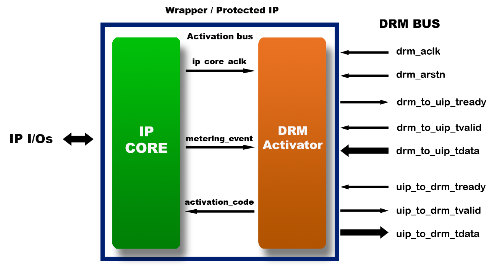
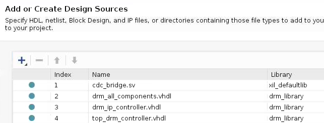
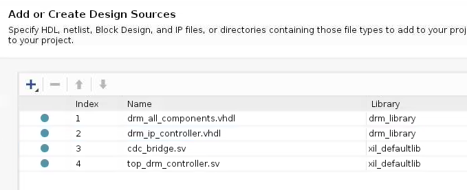

DRM Hardware integration
========================

This section gives the main steps to generate a bitstream including the DRM
controller and the protection blocks (DRM Activators) to integrate in the FPGA design.

.. note:: When the bitstream is loaded in the FPGA board, the design is initially locked.
          The Accelize DRM library API or service is then required to unlock the design with
          a valid license. See :doc:`drm_library_integration` for more information.

More details about DRM Controller and Activator logics can be found here:

* :doc:`drm_hardware_ip_controller`.
* :doc:`drm_hardware_ip_activator`.

Supported hardware
------------------

Here are the FPGA vendors, families and EDA tools that are
currently supported by the DRM HDK:

.. list-table::
   :header-rows: 1

   * - Vendor
     - Tools
     - Families
   * - Xilinx
     - * Vivado 2017.4
       * Vivado 2018.2
       * Vivado 2018.2.xdf
       * Vivado 2018.3
     - * Ultrascale+
       * Ultrascale
       * Virtex 7
       * Virtex 6
       * Spartan 6
       * Spartan 3a DSP
       * Spartan 3a
       * Kintex 7
       * Artix 7
   * - Intel
     - Quartus Prime 17.1
     - * Cyclone V
       * Arria 10 [#f1]_
       * Arria V GZ
       * Arria V
       * Stratix V


Identify how many IP cores must be protected
--------------------------------------------

Identify how many IP cores must be protected (including IP cores that are
already protected by a DRM activator) in your FPGA design. For example,
In the following figure, 7 IP cores must be protected (3 instances of IP core A,
1 instance of IP core B, 2 instances of IP core D, 1 instance of IP core E):

.. image:: _static/Bus-architecture.png
   :target: _static/Bus-architecture.png

You will also need to provide the Vendor-Library-Name-Version (VLNV) information
for each new IP core to protect.

Request DRM HDK from Accelize_
----------------------------------------------------------------------

Send a request for a DRM controller and DRM activators to Accelize, with the
following information:

* How many IP cores (including multiple instances of an IP core) must be
  protected
* How many already protected IP cores (and what IP cores) you must reuse
* For each IP core that must be protected and that is not already protected,
  provide a VLNV (Vendor name, Library name, design Name, Version number).
  For multiple instance IP cores, only one VLNV is required.

Receive DRM HDK from Accelize
-----------------------------

A zip file will be sent to you. It is containing the HDK sources with in 3 folders:

* The ``common`` folder: contain the IP common structure for the activator and the controller.

* The ``controller`` folder: contain the controller VHDL top-level and the Verilog Wrapper.
  The controller has the appropriate number of ports: one for each IP instance in your design
  (already protected IPs and IPs to protect), plus the common bus.

* The ``activator`` folder: contain the activator VHDL top-level and the Verilog Wrapper, and
  the *drm_activation_code_package* file which define the 128-bit activation code value.
  A single DRM Activator is delivered per IP core type. Multiple instances of the same IP
  core shall instantiate the same activator as many times.
  This folder also contains the *drm_activation_code_package* file which defines the unique activation code
  for this IP. It is accessible through the parameter ``C_DRM_ACTIVATION_CODE``.

Considering the previous example, you will receive:

* a DRM Controller IP with 7 ports,
* 1 DRM Activator of IP core A
* 1 DRM Activator of IP core B

Protect the IP cores
--------------------

There are different ways of doing this. In this document we propose to create a wrapper,
in which the DRM Activator and the IP core are instantiated. The original IP core will
have been to be slightly modified to include the activation code protection and the
usage measurement logic.
With this approach, managing multiple instances of the same protected IP is built-in.



.. note:: Clock and reset ports of the IP core are not represented on the figure but
          there could have a single or multiple clocks and resets ports.

1. Create a wrapper
~~~~~~~~~~~~~~~~~~~

The wrapper interface includes the original IP interface, plus the DRM specific
bus used to communicate with the DRM Controller.
Here are the Activator signals that shall be exposed on the wrapper interface
to be later connected to the DRM Controller:

  .. list-table::
     :header-rows: 1

     * - Name
       - Direction
       - Size
       - Description
     * - drm_arstn
       - in
       - 1
       - DRM AXI4-Stream bus Asynchronous Reset (active low)
     * - drm_aclk
       - in
       - 1
       - DRM AXI4-Stream bus Clock domain
     * - drm_to_uip_tready
       - out
       - 1
       - AXI4-Stream Ready signal for DRM Controller to IP Activator Channel
     * - drm_to_uip_tvalid
       - in
       - 1
       - AXI4-Stream Valid signal for DRM Controller to IP Activator Channel
     * - drm_to_uip_tdata
       - in
       - 32
       - AXI4-Stream Data signal for DRM Controller to IP Activator Channel
     * - uip_to_drm_tready
       - in
       - 1
       - AXI4-Stream Ready signal for IP Activator to DRM Controller Channel
     * - uip_to_drm_tvalid
       - out
       - 1
       - AXI4-Stream Valid signal for IP Activator to DRM Controller Channel
     * - uip_to_drm_tdata
       - out
       - 32
       - AXI4-Stream Data signal for IP Activator to DRM Controller Channel

2. Adapt the IP core
~~~~~~~~~~~~~~~~~~~~

Modify the IP core interface
^^^^^^^^^^^^^^^^^^^^^^^^^^^^

Add the following ports to the original IP core:

  .. list-table::
     :header-rows: 1

     * - Name
       - Direction
       - Size
       - Description
     * - ip_core_arstn
       - in
       - 1
       - IP Core Asynchronous Reset (active low)
     * - ip_core_aclk
       - in
       - 1
       - IP Core clock domain
     * - activation_code_ready
       - out
       - 1
       - Indicate the Activation Code is ready to be evaluated (synchronous to ip_core_aclk)
     * - activation_code
       - out
       - 128
       - Expose the Activation Code corresponding the current license key (synchronous to ip_core_aclk)
     * - metering_event
       - in
       - 1
       - A 1 clock cycle pulse (synchronous to ip_core_aclk) increments the Metering data counter
     * - metering_arst
       - in
       - 1
       - Metering Counter Synchronous (to ip_core_aclk) Reset (active high)

Protect relevant code of the IP core
^^^^^^^^^^^^^^^^^^^^^^^^^^^^^^^^^^^^

The most critical part is to smartly modify the original IP core so that
piece of the IP internal logic is combined with the activation code bits
provided by the DRM activator signal to enable or disable part or all
of the IP functionality.

The 128 bit activation code is unique and randomly generated by Accelize. It is
accessed through the ``C_DRM_ACTIVATION_CODE`` variable defined in the *drm_activation_code_package*
file of the HDK delivered by Accelize. Each IP core must have its own activation code.

The 128 bits of the activation code are used to create conditions for IP
activation/deactivation. There are different techniques to instrument the IP code:
individual bit, groups of bits, range of bits can be used in the code to:

* Gate signals,
* Switch FSM states,
* Select functional parts.

For instance, we propose to implement these 3 techniques on the 12 LSBs of
the ACTIVATION_CODE signal as follows:

* 8 bits are used to unlock FSMs transitions
* 4 bits are used to control a Data Path

.. image:: _static/Activation-code.png
   :target: _static/Activation-code.png

.. warning:: It is highly recommended to use as much as possible those techniques
             as it increases the protection against reverse engineering attacks.

.. important:: The DRM event and activation ports are synchronized on the ``ip_core_aclk``
             clock. Make sure a clock domain crossing technique is implemented
             when necessary.


Add metering logic
^^^^^^^^^^^^^^^^^^

Even if you have not planned to monetize your IP based on a "pay-per-use" model, we strongly
encourage to include in your IP core or wrapper some usage measurement logics to gather
anonymously some statistics information about the IP usage: a better understanding of
the actual IP usage might help to propose future solutions that would better
answer your customer needs.

1. First you need to determine which data metrics is the most relevant to count with regard
to the application domain.
Typically you would count the number of bytes processed by an encryption IP whereas
you would count the number of frames processed by a video rescaling IP.

2. Then instrument your code to measure your metrics. For instance count the number of
bytes processed.

3. When the metric unit is reached, generate a 1-clock cycle pulse (synchronized on
``ip_core_aclk``) on the ``metering_event`` port of the DRM Activator.
For instance, generate a pulse every 100M bytes.

Each pulse on ``metering_event`` increases the metering 64-bit counter by 1.
The value of this counter is transmitted to the DRM Web Service which converts it
in number of usage units for this particular account.

.. note:: Pay particular attention to the way the IP core drives this
          ``metering_event`` signal as it might be directly related to the business model.
          ``metering_event`` input is level-sensitive and must be de-asserted after each event.

.. warning:: The DRM event is synchronized on the ``ip_core_aclk``
             clock. Make sure a clock domain crossing technique is implemented
             when necessary.

.. important:: The ``metering_arst`` signal resets the metering counter.
             Therefore, it SHALL NOT be connected to a user-controllable
             reset as it will give the user a way to reset metering information
             before this information is actually sent to the DRM web service.
             If it happens, the end-user will not be charged for what he/she consumed.

3. Instantiate the adapted IP core and DRM Activator in the wrapper and connect them
~~~~~~~~~~~~~~~~~~~~~~~~~~~~~~~~~~~~~~~~~~~~~~~~~~~~~~~~~~~~~~~~~~~~~~~~~~~~~~~~~~~~

* Connect the signals of the DRM Activator listed by the table in section `Modify the IP core interface`_
  to the adapted IP core.
* Connect the DRM bus of the DRM Activator listed by the table in seciton `1. Create a wrapper`_
  to the wrapper interface.
* Connect the clock and reset of the adapted IP core to the wrapper interface.

4. Encrypt the Protect IPs
~~~~~~~~~~~~~~~~~~~~~~~~~~

.. warning:: Encrypting the Protected IP is mandatory since it contains the
               activation code in clear text.

Encrypt each protected IP in IEEE 1735 for Vivado or Ampcrypt for Quartus.
Please contact your EDA reseller for more information about IP encryption.

If your environment requires another encryption standard, please contact Accelize_.

Instantiate the Protected IP
----------------------------

Once your IP protected, they can be instantiated once or multiple times in your FPGA design.

Instantiate the DRM Controller IP
---------------------------------

A single DRM Controller must be instantiated in FPGA to interact with multiple
protected IP cores.

* Instantiate the DRM controller in the top level design
* Connect the DRM controller AXI4 lite interface with the AXI4 lite interface of the
  top level design
* **Make sure you use a correct offset address to access the DRM controller**
* Connect each DRM bus interface of the DRM controller to a DRM bus interface of a
  protected IP core.

.. image:: _static/AXI4-bus.png
   :target: _static/AXI4-bus.png


Synthesize and implement your design
------------------------------------

.. warning:: DRM source files (VHDL and Verilog) HAVE to be compiled
             under "drm_library" library.

Xilinx Vivado
~~~~~~~~~~~~~

Refer to `Supported hardware` for more information on supported Vivado versions.

For Vivado, GUI or TCL script can be used to synthesize the DRM controller and
the DRM Activator.
The DRM IPs are in VHDL but the DRM HDK also contains a Verilog wrapper.

VHDL
^^^^

DRM Contoller
`````````````
The DRM Controller top-level name is **drm_controller_ip_axi4st**.

To add the DRM Controller source to your project, you can use:

* the GUI during project wizard creation:



* Or a TCL script:

.. code-block:: tcl

   read_vhdl -library drm_library {
      drm_hdk/common/xilinx/drm_all_components.vhdl
      drm_hdk/contoller/drm_controller_ip.vhdl
      drm_hdk/contoller/drm_controller_ip_axi4st.vhdl
   }

DRM Activator
`````````````
The DRM Activator top-level name is **drm_ip_activator_0xVVVVLLLLNNNNVVVV_axi4st**.
0xVVVVLLLLNNNNVVVV is an hexadecimal string encoding the VLNV of this IP.

To add the DRM Activator source to your project, you can use:

* the GUI during project wizard creation:


Or a TCL script:

.. code-block:: tcl

   read_vhdl -library drm_library {
      drm_hdk/common/xilinx/drm_all_components.vhdl
      drm_hdk/activator_VLNV/rtl/drm_activation_code_package_0xVVVVLLLLNNNNVVVV.vhd
      drm_hdk/activator_VLNV/rtl/drm_ip_activator_0xVVVVLLLLNNNNVVVV.vhdl
      drm_hdk/activator_VLNV/rtl/drm_ip_activator_0xVVVVLLLLNNNNVVVV_axi4st.vhdl
   }

Verilog
^^^^^^^

DRM Contoller
`````````````
The DRM Controller top-level name is **drm_controller_ip_axi4st**.

To add the DRM Controller sources to your project, you can use:

* the GUI during project wizard creation:



Or a TCL script:

.. code-block:: tcl

   read_verilog -library drm_library {
      drm_hdk/controller/drm_controller_ip_axi4st.v
   }
   read_verilog -library drm_library {
      drm_hdk/common/xilinx/drm_all_components.vhdl
      drm_hdk/controller/drm_controller_ip.vhdl
   }

DRM Activator
`````````````
The DRM Activator top-level name is **drm_ip_activator_0xVVVVLLLLNNNNVVVV_axi4st**.
0xVVVVLLLLNNNNVVVV is an hexadecimal string encoding the VLNV of this IP.

To add the DRM Activator sources to your project, you can use:

* the GUI during project wizard creation:

.. image:: _static/Verilog-activator-vivado.png
   :target: _static/Verilog-activator-vivado.png

Or via TCL script:

.. code-block:: tcl

   read_verilog -library drm_library {
      drm_hdk/activator_VLNV/rtl/drm_activation_code_package_0xVVVVLLLLNNNNVVVV.v
      drm_hdk/activator_VLNV/rtl/drm_ip_activator_0xVVVVLLLLNNNNVVVV_axi4st.vhdl
   }
   read_vhdl -library drm_library {
      drm_hdk/common/xilinx/drm_all_components.vhdl
      drm_hdk/activator_VLNV/rtl/drm_ip_activator_0xVVVVLLLLNNNNVVVV.vhdl
   }

Intel Quartus Prime
~~~~~~~~~~~~~~~~~~~

Refer to `Supported hardware` for more information on supported Quartus versions.

.. note:: In the ``common`` folder of the DRM HDK, you will find an *altera* and an
          *alteraProprietary* subfolders. Both subfolders contain the same code but
          encrypted in IEEE-1735 and Ampcrypt respectively. Depending on the Quartus
          version, one or the other might not be supported.
          Make sure to replace the path with the correct subfolder in the rest of the page.

VHDL
^^^^

DRM Contoller
`````````````
The DRM Controller top-level name is **drm_controller_ip_axi4st**.

To add the DRM Controller source to your project, you can use:

* the GUI during project wizard creation:


Or a TCL script:

.. code-block:: tcl

   set_global_assignment -name SYSTEMVERILOG_FILE drm_hdk/common/alteraProprietary/altchip_id_arria10.sv -library drm_library
   set_global_assignment -name VHDL_FILE drm_hdk/common/alteraProprietary/drm_all_components.vhdl -library drm_library
   set_global_assignment -name VHDL_FILE drm_hdk/controller/drm_controller_ip.vhdl -library drm_library
   set_global_assignment -name VHDL_FILE drm_hdk/controller/drm_controller_ip_axi4st.vhdl -library drm_library

.. note:: The ``altchip_id_arria10.sv`` file is for the Arria10 FPGA family.
          Use the file located in the *common/sv/alteraProprietary* folder from your DRM HDK.

DRM Activator
`````````````
The DRM Activator top-level name is **drm_ip_activator_0xVVVVLLLLNNNNVVVV_axi4st**.
0xVVVVLLLLNNNNVVVV is an hexadecimal string encoding the VLNV of this IP.

To add the DRM Activator sources to your project, you can use:

* the GUI during project wizard creation:

.. image:: _static/VHDL-activator-quartus.png
   :target: _static/VHDL-activator-quartus.png

* Or a TCL script:

.. code-block:: tcl

   set_global_assignment -name SYSTEMVERILOG_FILE drm_hdk/common/alteraProprietary/altchip_id_arria10.sv -library drm_library
   set_global_assignment -name VHDL_FILE drm_hdl/common/alteraProprietary/drm_all_components.vhdl -library drm_library
   set_global_assignment -name VHDL_FILE drm_hdk/activator_VLNV/rtl/drm_activation_code_package_0xVVVVLLLLNNNNVVVV.vhdl -library drm_library
   set_global_assignment -name VHDL_FILE drm_hdl/activator_VLNV/rtl/drm_ip_activator_0xVVVVLLLLNNNNVVVV.vhdl -library drm_library
   set_global_assignment -name VHDL_FILE drm_hdl/activator_VLNV/rtl/drm_ip_activator_0xVVVVLLLLNNNNVVVV_axi4st.vhdl -library drm_library

.. note:: The ``altchip_id_arria10.sv`` file is for the Arria10 FPGA family.
          Use the file located in the *common/sv/alteraProprietary* folder from your DRM HDK.

Verilog
^^^^^^^

DRM Contoller
`````````````
The DRM Controller top-level name is **drm_controller_ip_axi4st**.

To add the DRM Controller sources to your project, you can use:

* the GUI during project wizard creation:


* Or a TCL script:

.. code-block:: tcl

   set_global_assignment -name SYSTEMVERILOG_FILE drm_hdk/common/alteraProprietary/altchip_id_arria10.sv -library drm_library
   set_global_assignment -name VHDL_FILE drm_hdk/common/alteraProprietary/drm_all_components.vhdl -library drm_library
   set_global_assignment -name VHDL_FILE drm_hdk/controller/drm_controller_ip.vhdl -library drm_library
   set_global_assignment -name VERILOG_FILE drm_hdk/controller/drm_controller_ip_axi4st.v -library drm_library

.. note:: The ``altchip_id_arria10.sv`` file is for the Arria10 FPGA family.
          Use the file located in the *common/sv/alteraProprietary* folder from your DRM HDK.


DRM Activator
`````````````
The DRM Activator top-level name is **drm_ip_activator_0xVVVVLLLLNNNNVVVV_axi4st**.
0xVVVVLLLLNNNNVVVV is an hexadecimal string encoding the VLNV of this IP.

To add the DRM Activator sources to your project, you can use:

* the GUI during project wizard creation:


* Or a TCL script:

.. code-block:: tcl

   set_global_assignment -name SYSTEMVERILOG_FILE drm_hdk/common/alteraProprietary/altchip_id_arria10.sv -library drm_library
   set_global_assignment -name VHDL_FILE drm_hdl/common/alteraProprietary/drm_all_components.vhdl -library drm_library
   set_global_assignment -name VHDL_FILE drm_hdl/activator_VLNV/rtl/drm_ip_activator_0xVVVVLLLLNNNNVVVV.vhdl -library drm_library
   set_global_assignment -name VERILOG_FILE drm_hdk/activator_VLNV/rtl/drm_activation_code_package_0xVVVVLLLLNNNNVVVV.v -library drm_library
   set_global_assignment -name VERILOG_FILE drm_hdl/activator_VLNV/rtl/drm_ip_activator_0xVVVVLLLLNNNNVVVV_axi4st.v -library drm_library

.. note:: The ``altchip_id_arria10.sv`` file is for the Arria10 FPGA family.
          Use the file located in the *common/sv/alteraProprietary* folder from your DRM HDK.


RTL Simulation
--------------

A DRM Controller bus functional model (BFM) is provided with the DRM HDK; it instantiates the
RTL model of the DRM Controller and internally implements a mechanism to load a license
file and generate signals and messages for debug.
The provided BFM is located into the `simu` folder of the Activator HDK part. It is specific
to each Activator. This is particularly interesting when the design instantiate multiple
Protected IPs. By this mean you can simulate each Protected IP (IP code + Activator)
separately from the rest of the design.

I/Os
~~~~

.. code-block:: VHDL

   entity drm_controller_bfm_axi4st is
   generic (
       LICENSE_FILE : string := ""
   );
   port (
     -- System Signals
     drm_aclk              : in  std_logic;
     drm_arstn             : in  std_logic;
     -- AXI4-Stream Bus to/from User IP
     drm_to_uip_tready     : in  std_logic;
     drm_to_uip_tvalid     : out std_logic;
     drm_to_uip_tdata      : out std_logic_vector(31 downto 0);
     uip_to_drm_tready     : out std_logic;
     uip_to_drm_tvalid     : in  std_logic;
     uip_to_drm_tdata      : in  std_logic_vector(31 downto 0);
     -- AXI4-Lite Register Access interface
     license_file_loaded   : out std_logic;
     activation_cycle_done : out std_logic;
     error_code            : out std_logic_vector(7 downto 0)
   );

.. code-block:: Verilog

   module drm_controller_bfm_axi4st
   #(
       parameter LICENSE_FILE : string = ""

   ) (
     // System Signals
     input  wire           drm_aclk              ,
     input  wire           drm_arstn             ,
     // AXI4-Stream Bus to/from User IP
     input  wire           drm_to_uip_tready     ,
     output wire           drm_to_uip_tvalid     ,
     output wire [31:0]    drm_to_uip_tdata      ,
     output wire           uip_to_drm_tready     ,
     input  wire           uip_to_drm_tvalid     ,
     input  wire [31:0]    uip_to_drm_tdata      ,
     // AXI4-Lite Register Access interface
     output wire           license_file_loaded   ,
     output wire           activation_cycle_done ,
     output wire [7:0]     error_code
   );

Usage
~~~~~

* Connect the DRM Bus port of the protected IP with the DRM Bus port of the
  DRM Controller BFM
* A default simulation license file is embedded in the DRM Controller BFM.
  It is automatically generated and delivered in the HDK, based on the IP
  registration data (first Activation Code). If a different one is needed,
  a new License File shall be explicitly requested to the DRM SaaS and assigned
  to the generic parameter LICENSE_FILE of the DRM Controller BFM.
  Contact Accelize_ for more details.
* Drive the DRM bus Clock and the DRM Bus Reset
* Observe the debug signals and messages
* Check for the IP Core activation


ModelSim Compilation and Simulation
~~~~~~~~~~~~~~~~~~~~~~~~~~~~~~~~~~~

Create libraries
^^^^^^^^^^^^^^^^

Two libraries are required : drm_library, drm_testbench_library

Library drm_library:

.. code-block:: tcl

   vlib drm_library
   vmap drm_library drm_library

Library drm_testbench_library:

.. code-block:: tcl

   vlib drm_testbench_library
   vmap drm_testbench_library drm_testbench_library

Compile the files in the following order:
* drm_hdk/activator_VLNV/simu/modelsim/drm_ip_activator_0xVVVVLLLLNNNNVVVV_axi4st.vhdl compiled in

Compile drm_all_components.vhdl under *drm_library* library:

.. code-block:: tcl

   vcom -93 -explicit -work drm_library drm_hdk/common/vhdl/modelsim/drm_all_components.vhdl

Compile drm_license_package.vhdl under *drm_testbench_library* library:

.. code-block:: tcl

   vcom -93 -explicit -work drm_testbench_library drm_hdk/activator_VLNV/simu/modelsim/drm_license_package.vhdl

Compile drm_controller_bfm.vhdl under *drm_testbench_library* library:

.. code-block:: tcl

   vcom -93 -explicit -work drm_testbench_library drm_hdk/activator_VLNV/simu/modelsim/drm_controller_bfm_axi4st.vhdl

Compile drm_ip_activator_0xVVVVLLLLNNNNVVVV_axi4st.vhdl under *drm_library* library:

.. code-block:: tcl

   vcom -93 -explicit -work drm_hdk/activator_VLNV/simu/modelsim/drm_ip_activator_0xVVVVLLLLNNNNVVVV_axi4st.vhdl|

Run simulation
^^^^^^^^^^^^^^

Start the simulation :

.. code-block:: tcl

   vsim -L drm_library -L drm_testbench_library -L  -t 1ps *

Run the simulation:

.. code-block:: tcl

   run -all

Expected Behavior
~~~~~~~~~~~~~~~~~

During DRM Bus reset the LICENSE_FILE_LOADED is set to '0', the
ACTIVATION_CYCLE_DONE is set to '0' and the ERROR_CODE is set to x"FF".

After DRM Bus reset, the DRM Controller BFM reads the License File and stores
it in the DRM Controller memory. When done the signal LICENSE_FILE_LOADED is set
to '1'.

In parallel, the DRM Controller runs the Activation cycle heartbeat. At the end
of the first Activation cycle, the ACTIVATION_CYCLE_DONE is set to '1' and the
ERROR_CODE is set to x"00" or x"0B" or x"0E". The value x"0B" or x"0E" means
that the License file is not yet completely written in the DRM Controller
memory, the LICENSE_FILE_LOADED being still set to '0' after the Activation
cycle start.

Ultimately, the ERROR_CODE shall be set to x"00" after a complete Activation
cycle following the LICENSE_FILE_LOADED set to '1'. If this does not happen,
the error codes can help to make decisions.

If OK, then the Protected IP is ready to be implemented on hardware.

.. image:: _static/behavior.png
   :target: _static/behavior.png

Signals for Debug
^^^^^^^^^^^^^^^^^

Debug signals are all  synchronized on the ``drm_aclk``.

* LICENSE_FILE_LOADED : when '1' indicates that the License file is
  loaded in the DRM Controller

* ACTIVATION_CYCLE_DONE : when '1' indicated that the DRM Controller
  has completed the first Activation cycle on the DRM Bus

* ERROR_CODE : 8 bits error code
    * x"FF" : not ready ; the DRM Controller operations are in progress
    * x"00" : no error ; the DRM Controller operations ran successfully
    * x"0B" : the License file is not conformed ; please ask for a new license
      file
    * x"0E" : the License File is corrupted ; please ask for a new license file
    * x"09", x"0F", x"10", x"11" , x"12", x"13", x"14": The DRM Controller
      cannot communicate with the IP Activator. Please check the DRM Bus
      connections, the DRM Clock generation
    * x"0A" : the DRM Controller and IP Activator versions are not compatible;
      please check that you are using the downloaded HDK without any
      modification
    * x"0C" : the DRM Controller and License File versions are not compatible ;
      please check that the right HDK version is used when asking for the
      Simulation License

Please communicate this error code when you contact Accelize_ for assistance.


.. _Accelize: https://www.accelize.com/contact-us

.. [#f1] Node-locked licensing mode not supported on
   `Intel PAC <https://www.intel.com/content/www/us/en/programmable/products/boards_and_kits/dev-kits/altera/acceleration-card-arria-10-gx.html>`_
   context, because Chip ID primitive is not reachable.
