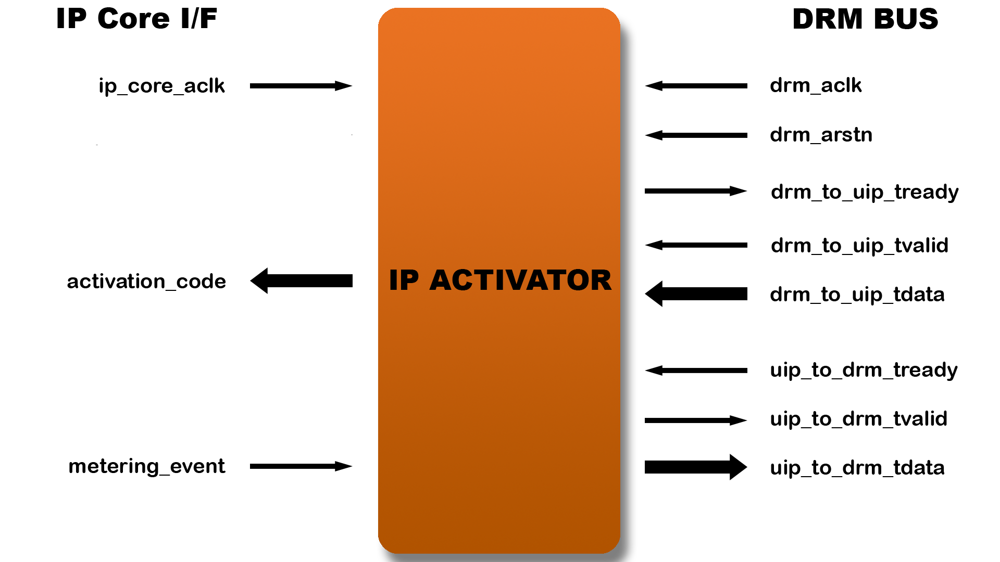
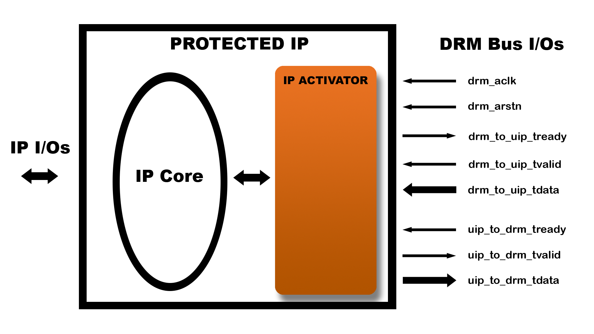

DRM Activator IP
================

This section is for application architects and IP designers who are willing
to protect at runtime their design and/or IP running on FPGA.
This document presents in details, the DRM Activator IP.

For information about the DRM Controller, see :doc:`drm_hardware_ip_controller`.

For information about hardware integration, see :doc:`drm_hardware_integration`.

Features
--------

The main functionality of the DRM Activator IP is to:

   * Deliver a 128 bits Activation Code to the IP Core for behavior control
   * Maintain a credit timer for time based activation
   * Store a metering counter for activities measurement

Block diagram
-------------

Interface description
---------------------

Reset and Clock
~~~~~~~~~~~~~~~

The IP Core clock domain and the DRM Bus clock domain can be asynchronous,
the IP Activator component implements the CDC (Clock Domain Crossing).

The resets are active low and asynchronous with the clocks.

DRM AXI4-Stream Bus connected to DRM controller
~~~~~~~~~~~~~~~~~~~~~~~~~~~~~~~~~~~~~~~~~~~~~~~

Communication on the DRM Bus uses an AXI4-Stream protocol where the IP
Activator is a slave and the DRM Controller is the master.
A single Controller is always required but any number of Activators
is supported (1 to N connections).

  .. list-table::
     :header-rows: 1

     * - Name
       - Direction
       - Size
       - Description
     * - drm_arstn
       - in
       - 1
       - DRM AXI4-Stream bus Asynchronous Reset (active low)
     * - drm_aclk
       - in
       - 1
       - DRM AXI4-Stream bus Clock domain: must be identical to the DRM Controller clock
     * - drm_to_uip_tready
       - out
       - 1
       - AXI4-Stream Ready signal for DRM to IP
     * - drm_to_uip_tvalid
       - in
       - 1
       - AXI4-Stream Valid signal for DRM to IP
     * - drm_to_uip_tdata
       - in
       - 32
       - AXI4-Stream Data signal for DRM to IP
     * - uip_to_drm_tready
       - in
       - 1
       - AXI4-Stream Ready signal for IP to DRM
     * - uip_to_drm_tvalid
       - out
       - 1
       - AXI4-Stream Valid signal for IP to DRM
     * - uip_to_drm_tdata
       - out
       - 32
       - AXI4-Stream Data signal for IP to DRM

DRM Activator interface with IP to protect
~~~~~~~~~~~~~~~~~~~~~~~~~~~~~~~~~~~~~~~~~~

The interface with the IP Core is a simple register interface with control
signals.

.. list-table::
   :header-rows: 1

   * - Name
     - Direction
     - Size
     - Description
   * - ip_core_aclk
     - in
     - 1
     - IP Core clock
   * - metering_event
     - in
     - 1
     - Level-sensitive signal synchronous to ip_core_aclk that increments the Metering counter when sampled to '1'
   * - activation_code
     - out
     - 128
     - Activation Code as provided by the License Key currently loaded.

.. note:: ``activation_code`` is synchronous to ``ip_core_aclk``.
           ``metering_event`` must be synchronous to ``ip_core_aclk``.

Operations
----------

Signals of the IP core that are interacting with the DRM Activator shall be
synchronized on the IP Core clock domain, ``ip_core_aclk`` signal. Internally,
the IP core shall implement its own CDC.

The IP Core uses the 128 bits of the Activation Code output to control FSM transition
and datapath gates.

The DRM Activator implements an internal 64-bit Metering counter that is used
to store the activity of the IP Core. It is reset synchronously via the DRM Bus
protocl when the session is closed.

It is incremented under the control of the IP Core by asserting the ``metering_event`` input
for 1 clock cycle. ``metering_event`` is a level-sensitive signal so make sure the signal
is de-asserted when the event has passed.

Implementation results
----------------------

.. list-table::
   :header-rows: 1

   * - FPGA
     - LUT
     - FF
     - RAM
   * - **Kintex ultrascale+**
     - 2200
     - 1800
     - 2 of 36Kbits, 18 of 18Kbits
   * - **Kintex 7**
     - 2400
     - 1900
     - 18 of 36Kbits

File structure
--------------

The IP HDK contains the components and models for compilation and simulation of
the assembly IP core + IP Activator.

IP Activator HDK directories and files:

.. code-block:: bash

   vendor_library_name_version/
   -- core/
   ----- constraints
   -------- constraints.sdc
   ----- drm_ip_activator_0xvvvvllllnnnnvvvv.vhdl
   ----- drm_ip_activator_0xvvvvllllnnnnvvvv.vho
   ----- drm_ip_activator_0xvvvvllllnnnnvvvv.veo
   ----- drm_ip_activator_package_0xvvvvllllnnnnvvvv.vhdl
   -- sim/
   ----- modelsim/
   -------- drm_controller_bfm.vhdl
   -------- drm_controller_bfm.v
   ----- xilinx_sim/
   -------- drm_controller_bfm.vhdl
   -------- drm_controller_bfm.v
   ----- drm_license_package.vhdl
   ----- drm_activator_0xvvvvllllnnnnvvvv_license_file.xml
   ----- drm_activator_0xvvvvllllnnnnvvvv_sim_pkg.sv
   ----- drm_activator_0xvvvvllllnnnnvvvv_sim_pkg.vhdl
   ----- top_drm_activator_0xvvvvllllnnnnvvvv_sim.sv
   ----- top_drm_activator_0xvvvvllllnnnnvvvv_sim.vhdl
   -- syn/
   ----- top_drm_activator_0xvvvvllllnnnnvvvv.v
   ----- top_drm_activator_0xvvvvllllnnnnvvvv.vhdl
   ---docs/
   common/
   -- sv/
   ----- altera/
   -------- altchip_id_arria10.sv
   ----- alteraProprietary/
   -------- altchip_id_arria10.sv
   -- vhdl/
   ----- altera/
   -------- drm_all_components.vhdl
   ----- alteraProprietary/
   -------- drm_all_components.vhdl
   ----- modelsim/
   -------- drm_all_components.vhdl
   ----- xilinx/
   -------- drm_all_components.vhdl

The IP Activator top-level file is ``top_drm_activator_0xvvvvllllnnnnvvvv.(v|vhdl)``.
It declares an entity named **top_drm_activator_0xVVVVLLLLNNNNVVVV** where
is a 64 bits hexadecimal encoding of the IP VLNV.

For example **top_drm_activator_0x0C001020A56E0001**

In the above example, the *altchip_id_arria10* files correspond to the Arria 10
FPGA family. Your `common` folder content might differ depending on the FPGA family you have
requested.

Implementation guidelines
-------------------------

A protected IP consists of the assembly of an IP Core and an IP Activator:

The IP Vendor shall modify the IP core in order to:

* Protect some relevant part of the code by adding conditional logics based on the
  Activation Code value (128 bits)
* Count data metrics related to the IP usage (byte, frame, or any other quantity) and generate
  a pulse on the DRM Activator event input every usage unit.

For information about hardware integration, see :doc:`drm_hardware_integration`.
