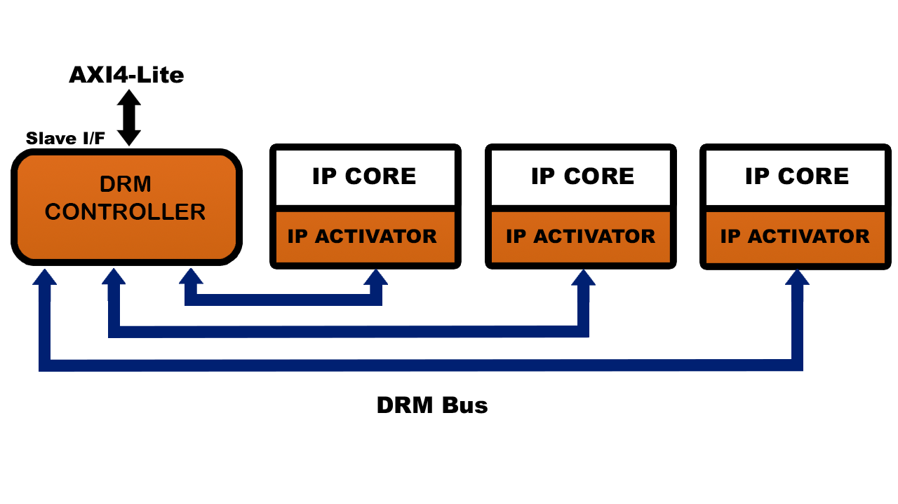

DRM Controller IP
=================

This section is for application architects and IP designers who are willing
to protect at runtime their design and/or IP running on FPGA.
This document presents in details, the DRM Activator IP.

For information about the DRM Controller, see :doc:`drm_hardware_ip_activator`.

For information about hardware integration, see :doc:`drm_hardware_integration`.

Features
--------

The DRM Controller manages the sensitive data communication between the System
Software (AXI4-Lite Status & Control interface) and the Protected IP Cores (DRM Bus interface).
The main functionality of the DRM Controller IP is to:

* Read and interpret the encrypted License Key and convey securely the
  Activation Codes and the Credit timers to the Protected IP Cores.
* Collect the Metering Data from the Protected IP Cores and deliver an encrypted
  and authenticated Metering Data block to the System.

The DRM Controller also gathers the design information (Protected IPs VLNVs, 64 bits each)
and the chip identifier (Public Chip ID (DNA) or PUF) that are required to request the License Key.

Block diagram
-------------

Interface description
---------------------

Example of a DRM Environment Topology:

DRM bus
~~~~~~~

The communication on the DRM Bus uses the AXI4-Stream protocol where the IP Activator
is a slave and the DRM Controller is the master.
The DRM bus size depends on the number of Protected IP cores in the design.
For each IP connected there are 3 parts:

* The Clock and Reset ports.

  .. list-table::
     :header-rows: 1

     * - Name
       - Direction
       - Size
       - Description
     * - drm_aclk
       - in
       - 1
       - DRM bus clock: must be identical to all the DRM Activators clock
     * - drm_arstn
       - in
       - 1
       - DRM bus asynchronous active low reset

* The DRM Controller to Activator channel:

  .. list-table::
     :header-rows: 1

     * - Name
       - Direction
       - Size
       - Description
     * - drm_to_uip<IDX>_tready
       - in
       - 1
       - AXI4-Stream Ready signal for DRM Controller to IP Activator Channel
     * - drm_to_uip<IDX>_tvalid
       - out
       - 1
       - AXI4-Stream Valid signal for DRM Controller to IP Activator Channel
     * - drm_to_uip<IDX>_tdata
       - out
       - 32
       - AXI4-Stream Data signal for DRM Controller to IP Activator Channel

* The Activator to DRM Controller channel:

  .. list-table::
     :header-rows: 1

     * - Name
       - Direction
       - Size
       - Description
     * - uip<IDX>_to_drm_tready
       - out
       - 1
       - AXI4-Stream Ready signal for IP Activator to DRM Controller Channel
     * - uip<IDX>_to_drm_tvalid
       - in
       - 1
       - AXI4-Stream Valid signal for IP Activator to DRM Controller Channel
     * - uip<IDX>_to_drm_tdata
       - in
       - 32
       - AXI4-Stream Data signal for IP Activator to DRM Controller Channel

AXI4-Lite Register Interface
~~~~~~~~~~~~~~~~~~~~~~~~~~~~

The communication with the Software layer is performed through an AXI4-Lite slave interface:

.. list-table::
   :header-rows: 1

   * - Name
     - Direction
     - Size
     - Description
   * - m_axi_aclk
     - in
     - 1
     - AXI4-Lite clock
   * - m_axi_arstn
     - in
     - 1
     - AXI4-Lite asynchronous reset active low
   * - m_axi_awready
     - out
     - 1
     - AXI4-Lite write address ready
   * - m_axi_awvalid
     - in
     - 1
     - AXI4-Lite write address valid
   * - m_axi_awaddr
     - in
     - 32
     - AXI4-Lite write address value
   * - m_axi_awprot
     - in
     - 3
     - AXI4-Lite write address protection type
   * - m_axi_wready
     - out
     - 1
     - AXI4-Lite write ready
   * - m_axi_wvalid
     - in
     - 1
     - AXI4-Lite write valid
   * - m_axi_wdata
     - in
     - 32
     - AXI4-Lite write data value
   * - m_axi_wstrb
     - in
     - 4
     - AXI4-Lite write strobes
   * - m_axi_bready
     - in
     - 1
     - AXI4-Lite write response ready
   * - m_axi_bvalid
     - out
     - 1
     - AXI4-Lite write response valid
   * - m_axi_bresp
     - out
     - 2
     - AXI4-Lite write response
   * - m_axi_arready
     - out
     - 1
     - AXI4-Lite read address ready
   * - m_axi_arvalid
     - in
     - 1
     - AXI4-Lite read address valid
   * - m_axi_araddr
     - in
     - 32
     - AXI4-Lite read address value
   * - m_axi_arprot
     - in
     - 3
     - AXI4-Lite read address protection type
   * - m_axi_rready
     - in
     - 1
     - AXI4-Lite read ready
   * - m_axi_rvalid
     - out
     - 1
     - AXI4-Lite read valid
   * - m_axi_rdata
     - out
     - 32
     - AXI4-Lite read data value
   * - m_axi_rresp
     - out
     - 2
     - AXI4-Lite read response

Chip DNA Interface
~~~~~~~~~~~~~~~~~~

Chip DNA is internally instantiated by the DRM Controller. It is exposed to
the user for his/her convenience.

.. list-table::
   :header-rows: 1

   * - Name
     - Direction
     - Size
     - Description
   * - chip_dna_valid
     - out
     - 1
     - Indicate the validity of the DNA value: 0=DNA not valid, 1=DNA valid
   * - chip_dna
     - out
     - 96
     - DNA as exposed by the chip

Registers
---------

The DRM Controller maintains different pages of registers that provide status and
allow control over the overall DRM system.
To operate correctly, those registers must be accessible in read and write mode by
Software layer (DRM Library).

Please refer to :doc:`drm_library_integration` for more information.

Implementation results
----------------------

Example for a DRM Controller supporting 10 IPs:

.. list-table::
   :header-rows: 1

   * - FPGA
     - LUT
     - FF
     - RAM
   * - **Kintex ultrascale+**
     - 11500
     - 6600
     - 5 of 36Kbits, 20 of 18Kbits
   * - **Kintex 7**
     - 12000
     - 6750
     - 3 of 36Kbits, 20 of 18Kbits

Timings
-------

The table below lists the performance of DRM Controller for some Xilinx FPGA families:

.. list-table::
   :header-rows: 1

   * - Xilinx Family
     - Frequency
     - Device documentation
   * - **ultrascale+**
     - 200MHz
     - `ds923 <https://www.xilinx.com/support/documentation/data_sheets/ds923-virtex_ultrascale-plus.pdf>`_
   * - **ultrascale**
     - 200MHz
     - `ds923 <https://www.xilinx.com/support/documentation/data_sheets/ds923-virtex_ultrascale-plus.pdf>`_
   * - **virtex 7**
     - 100MHz
     - `ds183 <https://www.xilinx.com/support/documentation/data_sheets/ds183_Virtex_7_Data_Sheet.pdf>`_
   * - **virtex 6**
     - Missing Data
     - `ds152 <https://www.xilinx.com/support/documentation/data_sheets/ds152.pdf>`_
   * - **spartan 6**
     - 2MHz
     - `ds162 <https://www.xilinx.com/support/documentation/data_sheets/ds162.pdf>`_
   * - **spartan 3a dsp**
     - 100MHz
     - `ds610 <https://www.xilinx.com/support/documentation/data_sheets/ds610.pdf>`_
   * - **spartan 3a**
     - 100MHz
     - `ds529 <https://www.xilinx.com/support/documentation/data_sheets/ds529.pdf>`_
   * - **kintex 7**
     - 100MHz
     - `ds182 <https://www.xilinx.com/support/documentation/data_sheets/ds182_Kintex_7_Data_Sheet.pdf>`_
   * - **artix 7**
     - 100MHz
     - `ds181 <https://www.xilinx.com/support/documentation/data_sheets/ds181_Artix_7_Data_Sheet.pdf>`_

The table below lists the performance of DRM Controller for some Intel/Altera FPGA families:

.. list-table::
   :header-rows: 1

   * - Intel Family
     - Frequency
     - Device documentation
   * - **cyclone v**
     - 100MHz
     - `altchipid <https://www.intel.com/content/dam/altera-www/global/en_US/pdfs/literature/ug/altchipid.pdf>`_
   * - **arria 10**
     - 30MHz
     - `altchipid <https://www.intel.com/content/dam/altera-www/global/en_US/pdfs/literature/ug/altchipid.pdf>`_
   * - **arria v gz**
     - 100MHz
     - `altchipid <https://www.intel.com/content/dam/altera-www/global/en_US/pdfs/literature/ug/altchipid.pdf>`_
   * - **arria v**
     - 100MHz
     - `altchipid <https://www.intel.com/content/dam/altera-www/global/en_US/pdfs/literature/ug/altchipid.pdf>`_
   * - **stratix v**
     - 100MHz
     - `altchipid <https://www.intel.com/content/dam/altera-www/global/en_US/pdfs/literature/ug/altchipid.pdf>`_

File structure
--------------

.. code-block:: bash

   controller/
   -- drm_controller_ip.v
   -- drm_controller_ip.vhdl
   -- drm_controller_ip_axi4st.v
   -- drm_controller_ip_axi4st.vhdl
   common/
   -- sv/
   ----- altera/
   -------- altchip_id_arria10.sv
   ----- alteraProprietary/
   -------- altchip_id_arria10.sv
   -- vhdl/
   ----- altera/
   -------- drm_all_components.vhdl
   ----- alteraProprietary/
   -------- drm_all_components.vhdl
   ----- modelsim/
   -------- drm_all_components.vhdl
   ----- xilinx/
   -------- drm_all_components.vhdl

Implementation guidelines
-------------------------

Only one DRM Controller can be instantiated in the Chip Design to serve multiple
Protected IPs.

Here is an overview of the steps needed to integrate a DRM Controller in a design:

* Specify the number of protected IP instances and get an appropriate
  DRM HDK from Accelize_.
* Instantiate the DRM Controller at the top level of the design.
* Connect the DRM Controller to the AXI4-Lite System Bus
* Protect the IPs by adding the DRM interface and instantiation the DRM Activator.
* Connect the different protected IP instances to the DRM Controller.

For information about hardware integration, see :doc:`drm_hardware_integration`.

.. _Accelize: https://www.accelize.com/contact-us
