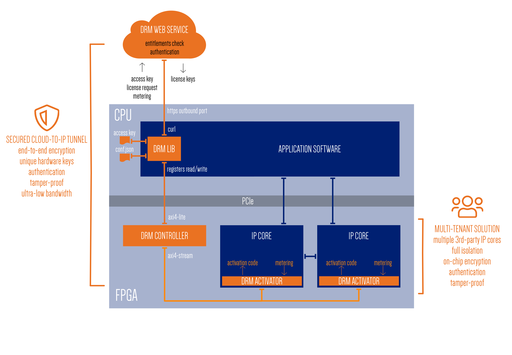

DRM Library integration
========================

The Accelize DRM can be integrated into an application using the library API.

The DRM library supports the following languages:

* C : :doc:`drm_library_api_c`
* C++ : :doc:`drm_library_api_cpp`
* Python : :doc:`drm_library_api_python`
* Cython : :doc:`drm_library_api_python`, Cython headers section (``.pxd`` files)

.. note:: No examples are provided in the Cython language, see the DRM library
          Python source code for an example of Cython integration.

Install DRM API
---------------

.. toctree::
   :maxdepth: 3

   drm_library_installation

Include DRM API
---------------

.. code-block:: c
    :caption: In C

    #include "accelize/drmc.h"

.. code-block:: c++
    :caption: In C++

    #include "accelize/drm.h"
    namespace drm = Accelize::DRM;

.. code-block:: python
    :caption: In Python

    from accelize_drm import DrmManager

Use DRM API in your code
------------------------

Create a DrmManager object
~~~~~~~~~~~~~~~~~~~~~~~~~~

To instantiate a DRM Manager object, the software developer needs to provide some inputs.

First, the DRM manager requires the paths to the ``conf.json`` and the ``cred.json`` files.
Those files are used to configure the DRM (i.e licensing mode) and authenticate the user.
See :doc:`drm_configuration` for more information about configuration files.

The DRM API needs to access the DRM controller registers in the design both in
read and write directions. The means to access these registers depend on the design and the driver.
So it is the user's responsibility to implement two callback functions (read and write functions)
to perform those registers access operations.

.. note:: The read and write register functions will be used asynchronously from  the rest
          of the application. Adequate protections against concurrent accesses is left to attention
          of the user.

Finally, the DRM Manager needs a third callback function to manage asynchronous errors that the DRM
thread might report. The most basic function is a call that simply displays the message.

In the following examples, The read and write registers function are named
``fpga_read_register`` and ``fpga_write_register`` and are imported from a
FPGA C library driver.

.. code-block:: c
    :caption: In C

    #include <stdio.h>

    // Define functions to read and write FPGA registers to use them as
    // callbacks in DrmManager.

    int read_register( uint32_t offset, uint32_t* value, void* user_p ) {
        return fpga_read_register( drm_controller_base_addr + offset, value );
    }

    int write_register( uint32_t offset, uint32_t value, void* user_p ) {
        return fpga_write_register( drm_controller_base_addr + offset, value );
    }

    // Define asynchronous error callback
    void asynch_error( const char* err_msg, void* user_p ) {
        fprintf( stderr, "%s", err_msg );
    }

    // Instantiate DrmManager with previously defined functions and
    // configuration files

    DrmManager* drm_manager = NULL;
    int ctx = 0;

    if ( DrmManager_alloc(
            &drm_manager,

            // Configuration files paths
            "./conf.json",
            "./cred.json",

            // Read/write register functions callbacks
            read_register,
            write_register,

            // Asynchronous error callback
            asynch_error,

            // Contextual pointer that the user can use at his/her convenience
            &ctx ) ) {
        // In the C case, the last error message is stored inside the
        // "DrmManager"
        fprintf( stderr, "%s", drm_manager->error_message );
    }

.. code-block:: c++
    :caption: In C++

    #include <iostream>
    #include <string>

    // Define functions to read and write FPGA registers and use them as
    // callbacks to instantiate the DrmManager.
    // Note: This example use C++11 Lambda function.

    drm::DrmManager drm_manager(
        // Configuration files paths
        "./conf.json",
        "./cred.json",

        // Read/write register functions callbacks
        [&](uint32_t offset, uint32_t* value) {
            return fpga_read_register( drm_controller_base_addr + offset, value );
        },

        [&](uint32_t offset, uint32_t value) {
            return fpga_write_register( drm_controller_base_addr + offset, value );
        },

        // Asynchronous error callback
        [&](const std::string &err_msg) {
            std::cerr << err_msg << std::endl;
            GlobalDrmError = true; // Any global machanism to warn the other threads of a DRM error
        }
    );

.. code-block:: python
    :caption: In Python

    # The FPGA driver is most likely written in C and read and write
    # functions can be imported using the "ctypes" module like in following
    # example
    import ctypes

    libfpga = ctypes.cdll.LoadLibrary("libfpga.so")

    fpga_read_register = libfpga.fpga_read_register
    fpga_read_register.restype = ctypes.c_int  # return code
    fpga_read_register.argtypes = (
        ctypes.c_uint32,  # offset
        ctypes.POINTER(ctypes.c_uint32)  # value
    )

    fpga_write_register = libfpga.fpga_write_register
    fpga_write_register.restype = ctypes.c_int  # return code
    fpga_write_register.argtypes = (
        ctypes.c_uint32,  # offset
        ctypes.c_uint32  # value
    )

    drm_manager = DrmManager(
        # Configuration files paths
        "./conf.json" ,
        "./cred.json" ,

        # Read/write register functions callbacks
        # Python lambda function are used to simplify code
        lambda offset, value: fpga_read_register(
            drm_controller_base_addr + offset, value),
        lambda offset, value: fpga_write_register(
            drm_controller_base_addr + offset, value),

        # Python API provides a default asynchronous error callback that
        # raise Python exceptions on error. It is possible to override it if
        # needed
        )

Activate the protected hardware
~~~~~~~~~~~~~~~~~~~~~~~~~~~~~~~

Once the ``DrmManager`` object allocated, you need to activate the protected IPs to use your design.
This is performed with the ``activate`` method.

When the function returns and the license is valid, the protected IPs are
guaranteed to be unlocked and usable.

In case of metering and floating licensing, this function spawns a thread
to keep the design unlocked and periodically send metering information
to the Accelize Web Service.

.. warning:: The activate method call may take few seconds.
             Especially on the first call due to internet and network delay.

.. code-block:: c
    :caption: C

    if ( DrmManager_activate( drm_manager, false ) )
        fprintf( stderr, "%s", drm_manager->error_message );

.. code-block:: c++
    :caption: C++

    try {
        drm_manager.activate();
    } catch( const drm::Exception& e ) {
        cerr << "DRM error: " << e.what() << endl;
    }

.. code-block:: python
    :caption: Python

    drm_manager.activate()

Deactivate the protected hardware
~~~~~~~~~~~~~~~~~~~~~~~~~~~~~~~~~

At the end of the application execution, when the protected IP is no longer
required, the DRM must be deactivated.

When this function returns, the protected IPs are guaranteed to be locked
(Except with the node-locked licensing mode where the IP is kept unlocked).

.. note:: Calling this function at the end of your application allows you to reuse the
          same design in different licensing modes without the need to recompile.

.. warning:: In Floating or Metering mode, the deactivate method call may take some seconds due to
             internet or network delay.

.. code-block:: c
    :caption: C

    if ( DrmManager_deactivate( drm_manager, false ) )
        fprintf( stderr, "%s", drm_manager->error_message );

    // In the C case, the "DrmManager" needs also to be freed to deallocate
    // associated resources.
    if ( DrmManager_free( &drm_manager ) )
        fprintf( stderr, "%s", drm_manager->error_message );

.. code-block:: c++
    :caption: C++

    try {
        drm_manager.deactivate();
    } catch( const drm::Exception& e ) {
        cerr << "DRM error: " << e.what() << endl;
    }

.. code-block:: python
    :caption: Python

    drm_manager.deactivate()

Compile your application
------------------------

.. note:: For SoM platform, refer to `Petalinux integration`_.

Your application needs to be linked against the adequate
C or C++ DRM library and have the thread support enabled.

.. code-block:: bash
    :caption: C with GCC compiler

    gcc source.c -pthread -laccelize_drmc -o application

.. code-block:: bash
    :caption: C++ with GCC compiler

    g++ source.cpp -pthread -laccelize_drm -o application

.. warning:: The library requires JsonCpp that is included as ``json/json.h`` for
             portability.

             On some OS like Ubuntu or CentOS, JsonCpp include is in a
             ``jsoncpp`` subdirectory of the system include directory
             (resulting in header file path ``jsoncpp/json/json.h``).

             Make sure to specify the correct JsonCpp include path when compiling.

             .. code-block:: bash
                :caption: GCC: JsonCpp include with an absolute path specification

                gcc source.c -pthread -laccelize_drmc -o application -I/usr/include/jsoncpp

             .. code-block:: bash
                :caption: CMake: JsonCpp include path auto-detection

                find_package(PkgConfig REQUIRED)
                pkg_check_modules(JSONCPP jsoncpp)
                include_directories(${JSONCPP_INCLUDEDIR})

Advanced usage
--------------

By default, the ``activate`` call creates a new DRM session and the ``deactivate`` call
closes it.

When a session is open, a call to the Accelize Web Service is performed to:

* get a new license key to unlock the hardware design
* get a new session ID

When a session is closed, the metering counter is reset and a call to the Accelize
Web Service is performed to:

* send the last metering data
* close the current session

In some cases, it might be useful to pause and resume a session instead of closing it, in particular
to keep the same session ID. It may also reduce the ``activate``/``deactivate``
call delay by skipping the license request to the Accelize Web Service if the license is
still valid.

.. warning:: Pausing a session at application level maintains the session open on Accelize Web Service.
             The session must be closed explicitly by the application before it terminates.

This strategy is usually not recommended but it can be useful in the following cases:

* As a general way, when there is no possibility to have a background service,
* When the call to the hardware function is short but frequent (less than the license
  expiration period).

Pausing/resuming a DRM session
~~~~~~~~~~~~~~~~~~~~~~~~~~~~~~

Following code snippets show how to implement pause/resume functionality:

.. code-block:: c
    :caption: C

    // Activate the DRM and resume the existing session if any
    if ( DrmManager_activate( drm_manager, true ) )
        fprintf( stderr, "%s", drm_manager->error_message );

    // [...]

    // Deactivate the DRM, but pause the session instead of closing it
    if ( DrmManager_deactivate( drm_manager, true ) )
        fprintf( stderr, "%s", drm_manager->error_message );

.. code-block:: c++
    :caption: C++

    // Activate the DRM and resume the existing session if any
    try {
        drm_manager.activate( true );

        // [...]

        // Deactivate the DRM, but pause the session instead of closing it
        drm_manager.deactivate( true );

    } catch( const drm::Exception& e ) {
        cerr << "DRM error: " << e.what() << endl;
    }

.. code-block:: python
    :caption: Python

    # Activate the DRM and resume the existing session if any
    drm_manager.activate(True)

    # [...]

    # Deactivate the DRM, but pause the session instead of closing it
    drm_manager.deactivate(True)

Petalinux integration
---------------------

We assume you have already a working petalinux build project.
From this project you must perform the following modifications:

Add Accelize DRM Library recipe
~~~~~~~~~~~~~~~~~~~~~~~~~~~~~~~

To compile the DRM Lib with Petalinux:

# Create a new 'accelizedrm' app in your petalinux project:

.. code-block:: bash
    :caption: bash

    $ petalinux-create -p <PROJECT_PATH> -t apps --template install -n accelizedrm --enable

# Replace the whole content of the recipe in <PROJECT_PATH>/project-spec/meta-user/recipes-apps/accelizedrm/accelizedrm.bb by this one:

.. code-block:: bash
    :caption: bash

    #
    # This file is the accelizedrm recipe.
    #

    SUMMARY = "Accelize DRM Library"
    SECTION = "PETALINUX/apps"
    LICENSE = "MIT"
    LIC_FILES_CHKSUM = "file://${COMMON_LICENSE_DIR}/MIT;md5=0835ade698e0bcf8506ecda2f7b4f302"

    SRC_URI = "gitsm://github.com/Accelize/drm.git;protocol=https;branch=som"
    SRCREV = "${AUTOREV}"

    DEPENDS += " \
        curl \
        jsoncpp \
    "

    S = "${WORKDIR}/git"

    inherit pkgconfig cmake

    FILES_${PN} += "${libdir}/*"

Modify your application recipe
~~~~~~~~~~~~~~~~~~~~~~~~~~~~~~

Edit the recipe of your main application and add the accelizedrm library to the list of dependencies.

.. code-block:: bash
    :caption: bash

    DEPENDS += " accelizedrm "

Modify your application code
~~~~~~~~~~~~~~~~~~~~~~~~~~~~

Here is the template of the final code: it provides the list of include to append and function calls to perform
before and after your own code.

.. code-block:: c
    :caption: In C

    #include "provencore.h"
    #include "service_ids.h"
    #include "accelize/drmc.h"

    /* File descriptor attached to device /dev/trustzone */
    static pnc_session_t *session;

    /* Virtual address and size of the mapped [tzfd] file */
    static void *tzvaddr;
    static size_t tzsize = 0;

    //*******************************************
    // DRM Controller communication callbacks
    //*******************************************

    static uint32_t shm_offset = 0;
    //
    // DRMLib Read Callback Function
    //
    int32_t drm_read_callback(uint32_t addr, uint32_t *value, void* context) {
        uint32_t *shmem = (uint32_t*)context;
        *value = *(shmem + shm_offset + (addr >> 2));
        return 0;
    }

    //
    // DRMLib Write Callback Function
    //
    int32_t drm_write_callback(uint32_t addr, uint32_t value, void* context) {
        uint32_t *shmem = (uint32_t*)context;
        if (addr == 0) {
            if (value > 5)
                return -1;
            shm_offset = shmem[value];
        }
        *(shmem + shm_offset + (addr >> 2)) = value;
        return 0;
    }

    //
    // DRMLib Error Callback Function
    //
    void drm_error_callback( const char* errmsg, void* user_p ){
        printf("DRM ERROR: %s", errmsg);
    }

    //*******************************************
    // MAIN
    //*******************************************

    int main(int argc, char **argv) {

        int ret = 0;
        uint32_t *shmem = nullptr;
        DrmManager *pDrmManager = nullptr;
        uint32_t reg = 0;

        // ACCELIZE CODE TO START TEE APPLICATION
        if (pnc_session_new(ALLOC_SIZE, &session) < 0) {
            printf("could not open trustzone module (%s)\n", strerror(errno));
            return EXIT_FAILURE;
        }
        for (int timeout = 10; timeout > 0; timeout--) {
            ret = pnc_session_config(session, SID_DRMCTRL, true);
            if (ret < 0) {
                if (errno == EAGAIN) {
                    sleep(1);
                    continue;
                }
                printf("could not allocate data (%s)\n", strerror(errno));
                pnc_session_destroy(session);
                return -1;
            }
            break;
        }
        if (ret < 0) {
            printf("could not allocate data (timeout)\n");
            pnc_session_destroy(session);
            return -1;
        }

        // get virtual address and size of shared memory region
        if (pnc_session_getinfo(session, &tzvaddr, &tzsize) < 0) {
            printf("could not get info (%s)\n", strerror(errno));
            pnc_session_destroy(session);
            return -1;
        }
        if (tzvaddr == NULL) {
            printf("could not map shm buffer (%s)\n", strerror(errno));
            pnc_session_destroy(session);
            return -1;
        }

        // ask drm controller app to initialize shared memory
        if (pnc_session_request(session, DRM_INIT_SHM, 0) < 0) {
            printf("failed to send command (%s)\n", strerror(errno));
            pnc_session_destroy(session);
            return -1;
        }

        // create casted pointer to shared memory
        shmem = (uint32_t*)tzvaddr;
        shm_offset = shmem[0];

        // ACCELIZE CODE TO UNLOCK APPLICATION STARTS HERE
        if (DRM_OK != DrmManager_alloc(&pDrmManager,
                "/usr/bin/conf.json", "/usr/bin/cred.json",
                drm_read_callback, drm_write_callback, drm_error_callback,
                tzvaddr )) {
            printf("ERROR: Error allocating DRM Manager object: %s\n", pDrmManager->error_message);
            pnc_session_destroy(session);
            return -1;
        }
        if (DRM_OK != DrmManager_activate(pDrmManager, false)) {
            printf("ERROR: Error activating DRM Manager object: %s\n", pDrmManager->error_message);
            pnc_session_destroy(session);
            return -1;
        }

        //
        // YOUR CODE HERE
        //

        // ACCELIZE CODE TO LOCK APPLICATION STARTS HERE
        if (DRM_OK != DrmManager_deactivate(pDrmManager, false)) {
            printf("ERROR: Error deactivating DRM Manager object: %s\n", pDrmManager->error_message);
            goto quit;
        }
        if (DrmManager_free(&pDrmManager))
            printf("ERROR: Failed to free DRM manager object: %s\n", pDrmManager->error_message);

        // ACCELIZE CODE TO CLOSE TEE APPLICATION
        pnc_session_destroy(session);
        return ret;
    }

.. code-block:: c++
    :caption: In C++

    #include "provencore.h"
    #include "service_ids.h"
    #include "accelize/drm.h"
    namespace drm = Accelize::DRM;

    //*******************************************
    // DRM Controller communication callbacks
    //*******************************************

    static uint32_t shm_offset = 0;
    //
    // DRMLib Read Callback Function
    //
    int32_t drm_read_callback(uint32_t addr, uint32_t *value, void* context) {
        uint32_t *shmem = (uint32_t*)context;
        *value = *(shmem + shm_offset + (addr >> 2));
        return 0;
    }

    //
    // DRMLib Write Callback Function
    //
    int32_t drm_write_callback(uint32_t addr, uint32_t value, void* context) {
        uint32_t *shmem = (uint32_t*)context;
        if (addr == 0) {
            if (value > 5)
                return -1;
            shm_offset = shmem[value];
        }
        *(shmem + shm_offset + (addr >> 2)) = value;
        return 0;
    }

    //
    // DRMLib Error Callback Function
    //
    void drm_error_callback( const char* errmsg, void* user_p ){
        printf("DRM ERROR: %s", errmsg);
    }

    //*******************************************
    // MAIN
    //*******************************************

    int main(int argc, char **argv) {

        int ret = 0;
        uint32_t *shmem = nullptr;
        DrmManager *pDrmManager = nullptr;
        uint32_t reg = 0;

        // ACCELIZE CODE TO START TEE APPLICATION
        if (pnc_session_new(ALLOC_SIZE, &session) < 0) {
            printf("could not open trustzone module (%s)\n", strerror(errno));
            return EXIT_FAILURE;
        }
        for (int timeout = 10; timeout > 0; timeout--) {
            ret = pnc_session_config(session, SID_DRMCTRL, true);
            if (ret < 0) {
                if (errno == EAGAIN) {
                    sleep(1);
                    continue;
                }
                printf("could not allocate data (%s)\n", strerror(errno));
                pnc_session_destroy(session);
                return -1;
            }
            break;
        }
        if (ret < 0) {
            printf("could not allocate data (timeout)\n");
            pnc_session_destroy(session);
            return -1;
        }

        // get virtual address and size of shared memory region
        if (pnc_session_getinfo(session, &tzvaddr, &tzsize) < 0) {
            printf("could not get info (%s)\n", strerror(errno));
            pnc_session_destroy(session);
            return -1;
        }
        if (tzvaddr == NULL) {
            printf("could not map shm buffer (%s)\n", strerror(errno));
            pnc_session_destroy(session);
            return -1;
        }

        // ask drm controller app to initialize shared memory
        if (pnc_session_request(session, DRM_INIT_SHM, 0) < 0) {
            printf("failed to send command (%s)\n", strerror(errno));
            pnc_session_destroy(session);
            return -1;
        }

        // create casted pointer to shared memory
        shmem = (uint32_t*)tzvaddr;
        shm_offset = shmem[0];

        // ACCELIZE CODE TO UNLOCK APPLICATION STARTS HERE
        try {
            pDrmManager = new DrmManager(
                std::string("/usr/bin/conf.json"),
                std::string("/usr/bin/cred.json"),
                [&]( uint32_t  offset, uint32_t * value) {      // Read DRM register
                    return  drm_read_callback(offset, value, shmem);
                },
                [&]( uint32_t  offset, uint32_t value) {        // Write DRM register
                    return drm_write_callback(offset, value, shmem);
                },
                [&]( const  std::string & err_msg) {
                   drm_error_callback(err_msg.c_str(), nullptr);
                }
            );
            pDrmManager->activate();
        } catch( const Exception& e ) {
            printf("ERROR: DRM failure: %s\n", e.what());;
            printf("Closing ProvenCore session...\n");
            pnc_session_destroy(session);
            return -1;
        }

        //
        // YOUR CODE HERE
        //

        // ACCELIZE CODE TO LOCK APPLICATION STARTS HERE
        try {
            pDrmManager->deactivate();
        } catch( const Exception& e ) {
            printf("DRM ERROR: %s\n", e.what());
        }
        delete pDrmManager;

        // ACCELIZE CODE TO CLOSE TEE APPLICATION
        pnc_session_destroy(session);
        return ret;
    }

Then you can build your petalinux project as usual.

Full API documentation
----------------------

For more information about the API in your favorite language, refer to :doc:`drm_library_api`.
