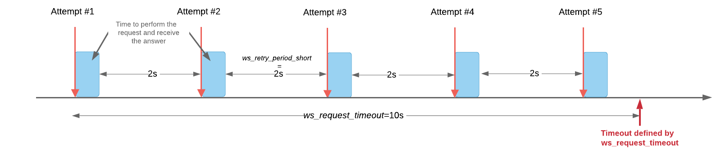
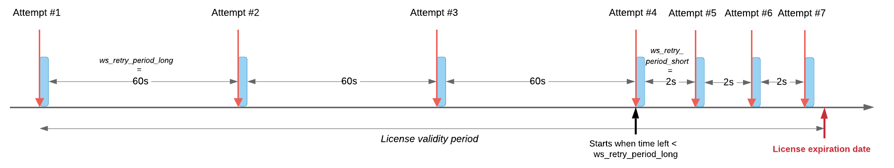

DRM SW Advanced Description
===========================

The DRM Library has some configuration parameters used to:
- Get some status informaton,
- Set configuration parmater like timeout,
- Customize some behavior.

.. warning:: Most of these parameters are critical for the system to operate correctly.
             Any modification without being adviced is at you own risk.
             Please contact the support team for additional information.

Accessing parameters
--------------------

There are 2 ways to overwrite the default value of parameters:

* At start-up, through the DRM Configuration file ``conf.json``: A **settings** section in the
  JSON file can be used to list the parameters that must be overwritten. When the object is
  created, the constructor initialize each parameter in the list with its correpsonding value.
  This file is managed by the application vendor.

  .. code-block:: json
    :caption: Parameters from Config JSON file

    {
        "licensing": {
            "url": "https://master.metering.accelize.com"
        },
        "drm": {
            "frequency_mhz": 125
        },
        "design": {
            "boardType": "ISV custom application"
        },
        "settings": {
            "log_verbosity": 1,
            "log_format": "*** [%H:%M:%S %z] [thread %t] %v ***"
        }
    }

* Dynamically from your code, using the get and set functions. Some parameters can be written
  once by the config file only and can therefore not be modified by these functions.

  .. code-block:: c++
        :caption: C++ get/set functions

        drm_manager_ptr->set<int32_t>( Accelize::DRM::ParameterKey::custom_field, 0x12345678 );    // Set new value to parameter
        int32_t value = drm_manager_ptr->get<int32_t>( Accelize::DRM::ParameterKey::custom_field );  // Get current value of parameter

  .. code-block:: c
        :caption: C get/set functions

        if ( DrmManager_set_int( drm_manager_ptr, Accelize::DRM::DRMParameterKey::custom_field, 0x12345678 ) )
            fprintf( stderr, drm_manager.error_message );

        int32_t value;
        if ( DrmManager_get_int( drm_manager_ptr, Accelize::DRM::DRMParameterKey::custom_field, &value ) )
            fprintf( stderr, drm_manager.error_message );

  .. code-block:: python
        :caption: Python get/set functions

        drm_manager.set(custom_field=0x12345678)
        value = drm_manager.get('custom_field')

List of parameters
------------------

=============================  ========  ============  ======================  =============================================
Parameter                      Type      Access        Constraint              Description
=============================  ========  ============  ======================  =============================================
license_type                   string    Read-only     -                       return the license type: node-locked, floating/metering
license_duration               uint32_t  Read-only     -                       return the duration in seconds of the current or last license
num_activators                 uint32_t  Read-only     -                       return the number of activators detected by the DRM controller
session_id                     string    Read-only     -                       return the current session ID
session_status                 bool      Read-only     true or false           indicate if a session is currently open
license_status                 bool      Read-only     -                       indicate if a license is running in the Controller
metered_data                   uint64_t  Read-only     -                       return the current value of the metering data counter
nodelocked_request_file        string    Read-only     -                       return the path to the node-locked license request JSON file
drm_frequency                  int32_t   Read-only     -                       return the measured DRM frequency
drm_license_type               string    Read-only     -                       return the license type of the DRM Controller: node-locked, floating/metering
product_info                   string    Read-only     -                       return the product information stored in the DRM Controller Read Only Mailbox
mailbox_size                   uint32_t  Read-only     -                       return the size of the Mailbox read-write memory in DRM Controller
token_string                   string    Read-only     -                       return the token string
token_validity                 uint32_t  Read-only     -                       return the validity in seconds of the current token as provided by the WOAuth2 WS
token_time_left                uint32_t  Read-only     -                       return the number of seconds left until the current token expires
frequency_detection_method     int32_t   Read-only     -                       return the method index used to detect the DRM frequency
bypass_frequency_detection     bool      Read-only     true or false           return true if the frequency detection system is disabled, false otherwise
log_file_path                  string    Read-(write)  -                       read (or write) the logging file path: default path is "./drm_lib.log". Can be set only from configuration file (no override from C/C++ code)
log_file_type                  int32_t   Read-(write)  [0-2]                   read (or write) the logging file type 0=no logging file, 1=basic file, 2=rotation file. Set only from configuration file (no override from C code)
log_file_rotating_size         int32_t   Read-(write)  -                       read (or write) the logging rotating file size in KBytes: default=1024 (KBytes). Set only from configuration file (no override from C code)
log_file_rotating_num          int32_t   Read-(write)  -                       read (or write) the logging rotating number of backup files: default=3. Set only from configuration file (no override from C code)
log_file_verbosity             int32_t   Read-write    [0-6]                   read and write the logging verbosity on the file: 0=trace, 6=quiet
log_file_format                string    Read-write    -                       read and write the logging file format. Refer to spdlog reference manual (https://github.com/gabime/spdlog/wiki/3.-Custom-formatting)
log_verbosity                  int32_t   Read-write    [0-6]                   read and write the logging verbosity on the stdout/stderr: 0=trace, 6=quiet
log_format                     string    Read-write    -                       read and write the logging file format. Refer to spdlog reference manual (https://github.com/gabime/spdlog/wiki/3.-Custom-formatting)
frequency_detection_threshold  double    Read-write    [0.0-100.0]             read and write the accepted percentage of error between the frequency set in the conf file and the measured frequency
frequency_detection_period     uint32_t  Read-write    [100-1000]              read and write the period of time in milliseconds used to measure the real DRM Controller frequency
custom_field                   uint32_t  Read-write    -                       only for testing, a register accessible to the user for any purpose
mailbox_data                   string    Read-write    32 * mailbox size       only for testing, read or write values to Mailbox read-write memory in DRM Controller
ws_retry_period_long           uint32_t  Read-write    << license duration     read and write the time in seconds before the next request attempt to the Web Server when the time left before timeout is long
ws_retry_period_short          uint32_t  Read-write    < ws_retry_period_long  read and write the time in seconds before the next request attempt to the Web Server when the time left before timeout is short
ws_request_timeout             uint32_t  Read-write    >0                      read and write the web service request timeout in seconds during which the response is waited
log_message_level              int32_t   Read-write    -                       only for testing, read and write the log level used with log_message parameter to set the message level
list_all                       string    Read-only     -                       list all parameter keys available
dump_all                       string    Read-only     -                       read all parameter key values
page_ctrlreg                   string    Read-only     -                       return nothing, print all registers in the DRM Controller Registry page
page_vlnvfile                  string    Read-only     -                       return nothing, print all registers in the VLNV File page
page_licfile                   string    Read-only     -                       return nothing, print all registers in the License File page
page_tracefile                 string    Read-only     -                       return nothing, print all registers in the Trace File page
page_meteringfile              string    Read-only     -                       return nothing, print all registers in the Metering File page
page_mailbox                   string    Read-only     -                       return nothing, print all registers in the Mailbox page
hw_report                      string    Read-only     -                       return nothing, print the Algodone HW report
trigger_async_callback         string    Write-only    -                       only for testing, call the asynchronous error callback with the given message
log_message                    string    Write-only    -                       only for testing, insert a message with the value as content
hdk_compatibility              string    Read-only     -                       only for testing, return the lower version of the HDK it is compatible with
health_period                  uint32_t  Read-only     >=0                     return the current value of the health period. 0 means the asychronous feature is disabled
health_retry                   uint32_t  Read-only     >=0                     return the current value of the health retry timeout. 0 means there will be no retry
health_retry_sleep             uint32_t  Read-only     >=0                     return the current value of the health retry sleep
ws_api_retry_duration          uint32_t  Read-write    >=0                     read and write the period of time in seconds during which retries occur on activate and deactivate functions
host_data_verbosity            uint32_t  Read-(write)  [0:2]                   read (and write) the level of verbosity for the amont of host and card data collected. Set only from configuration file (no override from user's code)
host_data                      string    Read-only     -                       read the host and card information
log_file_append                bool      Read-(write)  true or false           read (and write) the appending parameter for the basic logging file. Set only from configuration file (no override from user's code)
ws_verbosity                   uint32_t  Read-(write)  -                       read (and write) the curl verbosity. Set only from configuration file (no override from user's code)
trng_status                    string    Read-only     -                       read the TRNG related status registers
num_license_loaded             uint32_t  Read-only     -                       read the number of licenses provisioned in the DRM Controller
=============================  ========  ============  ======================  =============================================

Detailed explanation
--------------------

Retry mechanism for the license request
~~~~~~~~~~~~~~~~~~~~~~~~~~~~~~~~~~~~~~~

There are 2 types of retry mechanisms:

* One is occurring on the first license request
* The other one takes place on license request renewal

On the First request
^^^^^^^^^^^^^^^^^^^^

By default a retry mechanism is implemented when the ``activate`` function is called.

The retry definition has 2 parameters:

- **ws_retry_period_short**: wait period in seconds before a new attempt is performed;
                             set to 2s by default
- **ws_request_timeout**: period in seconds during which the retry takes place;
                          set to 10s by default

.. note:: These parameter values can be changed using the configuration file or the code.

On the other requests
^^^^^^^^^^^^^^^^^^^^^

By default a retry mechanism is implemented in the background thread when a new license needs
to be renewed.

The retry definition has 2 parameters:

- **ws_retry_period_long**: large wait period in seconds before a new attempt is performed;
                            set to 60s by default
- **ws_retry_period_short**: short wait period in seconds before a new attempt is performed;
                             set to 2s by default

The retry period starts when the DRM Controller is ready to receive a new license and lasts
until the license expires:

- The retry periodicity is initially set to ws_retry_period_long until the license
  expiration time is inferior to ws_retry_period_long
- Then the retry periodicity is set to ws_retry_period_short until the license expiration
  occurred.

.. note:: These parameters can be changed using the configuration file or the code.
