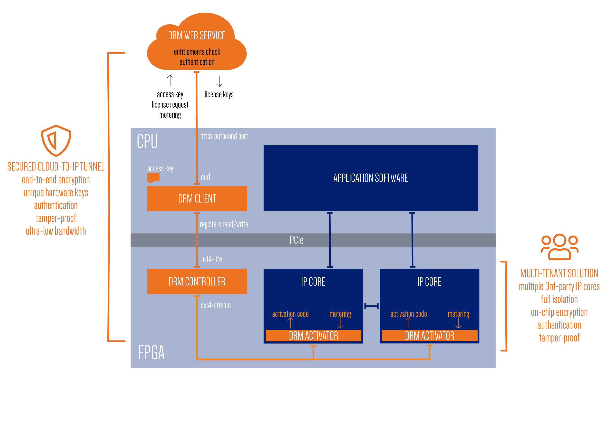

Accelize DRM
============

FPGA Licensing Principle
------------------------

The core licensing technology is based on a license key that unlocks at runtime
the proper operation of an FPGA design. The license key is loaded into the FPGA
after its configuration, usually through PCIe.

The license key is an encrypted container that delivers a secret Activation Code
to each protected function inside the FPGA. Protected function can only operate
properly when the secret activation code has been received electrically within
the function’s digital logic. This protection is implemented into HDL, by using
individual bits of the activation code to insert blocking points into control
logic and masking points into datapath logic.

The encryption key for the license key is unique per FPGA, derived from a unique
hardware identifier such as the Xilinx DNA or the Intel CHIP_ID. Thus, a license
key can exclusively unlock the FPGA device is has been generated for; any attempt
to load a license key into another FPGA device will fail.

Here's a short `video <https://www.youtube.com/watch?v=7cb_ksLTcRk>`_ presenting
an overview of the Accelize Platform and its integration.

Licensing Modes
---------------

The Accelize licensing technology is offered in two distinct modes:

* Static licensing

  A file-based scheme implemented by statically packaging the license key into
  an encrypted license file, stored locally on the server that hosts the FPGA card.

* Dynamic licensing

  A server-based scheme implemented by delivering license keys from a license
  server. Specifically, the license server delivers a regular stream of time-limited
  single-use license keys.

Licensing Models
----------------

With these two licensing modes - static and dynamic -, Accelize offers 3 distinct
licensing models:

* Nodelocked
* Floating
* Metered

Nodelocked Licensing
~~~~~~~~~~~~~~~~~~~~

Nodelocked licensing is a static licensing mode. A Nodelocked license is a license
grant which allows an application to be executed on a specific FPGA card, and only
on that card. Nodelocked licenses are granted to specific FPGA cards and are perpetual,
transferable, and non-revocable.

Floating Licensing
~~~~~~~~~~~~~~~~~~

Floating licensing is a dynamic licensing mode. A Floating license is a license grant
which allows a specified number of concurrent instances of the application to be executed
on any FPGA card. Floating licenses are granted to authenticated users, and the DRM
service dynamically enforces the maximum number of concurrent instances allowed.

Metered Licensing
~~~~~~~~~~~~~~~~~

Metered licensing is also a dynamic licensing mode. A Metered license is a license
grant which allows unlimited execution of an application on any FPGA card, and incurs
post-use monthly billing based on measured usage. Metered licenses grants are bound to
authenticated users, and the DRM service dynamically and securely collects the metering
information generated within the FPGA. Metering metrics include time, as well as any
measurable quantity within the FPGA, such as data volume, data type, processing requests,
application-specific events, etc.

Licensing Flexibility
---------------------

The Accelize licensing technology dynamically supports all licensing modes without any
change to the FPGA application. Thus, one can build and deploy a unique FPGA bitstream
and dynamically select the desired licensing model for each user, or even each execution.

Get more details on `Accelize blog <https://www.accelize.com/blog/accelize-licensing-technology>`_.

Architecture Overview
---------------------

The Accelize DRM solution comprises 3 layers:

* FPGA
  HDL IPs that must be embedded into the FPGA design. Specifically, exactly one DRM
  Controller IP, and one or more DRM Activator IPs. The Activators must be embedded
  within each protected function. These IPs are delivered in the DRM HDK.

* Host
  The DRM client, a lightweight service that executes on the host CPU, whose main
  function is to connect the FPGA DRM IPs with either the DRM Web Service (dynamic
  licensing) or a local license key file (static licensing). The DRM client is delivered
  as a DRM Library in C/C++ and Python.

* Web Service
  A fully managed DRM Web Service operated by Accelize. The Web service is only used
  in dynamic licensing and handles user authentication, licensing and metering. Upon
  special request, the DRM Web Service can deployed on-premise.

.. important:: 1 FPGA image = 1 DRM Controller = 1 DRM Client process

Semantic Versioning
-------------------

We comply with the semantic versioning defined by `semver.org <https://semver.org>`_.

Given a version number MAJOR.MINOR.PATCH, increment the:

- MAJOR version when you make incompatible API changes,
- MINOR version when you add functionality in a backwards compatible manner, and
- PATCH version when you make backwards compatible bug fixes.
Additional labels for pre-release and build metadata are available as extensions to the MAJOR.MINOR.PATCH format.

Glossary
--------

.. list-table::
   :header-rows: 1

   * - Word
     - Description
   * - **AC**
     - Activation Code
   * - **DRM**
     - Digital Rights Management
   * - **DNA**
     - A unique chip identifier; could be deliver by a PUF
   * - **PUF**
     - Physically Unclonable Function
   * - **VLNV**
     - Vendor Library Name Version
   * - **IP Core**
     - Functional block to be protected
   * - **Protected IP**
     - IP Core + DRM instrumentation
   * - **DRM Enabled IP**
     - a Protected IP
   * - **CDC**
     - Clock Domain Crossing
   * - **Credit Timer**
     - For Activation Duration controlled by the IP Activator, one per Protected IP

.. toctree::
   :maxdepth: 3
   :caption: Getting Started

   drm_getting_started
   drm_licensing_nodelocked
   drm_troubleshooting

.. toctree::
   :maxdepth: 3
   :caption: DRM-HDK Reference Manual

   drm_hardware_ip_activator
   drm_hardware_ip_controller
   drm_hardware_integration

.. toctree::
   :maxdepth: 3
   :caption: DRM-Library Reference Manual

   drm_library_installation
   drm_library_integration
   drm_library_api
   drm_configuration

.. toctree::
   :maxdepth: 3
   :caption: DRM Advanced Description

   drm_library_build
   drm_sw_advanced_description
   drm_migration_description

.. toctree::
   :maxdepth: 3
   :caption: Links

   contacts
   Accelize Website <https://www.accelize.com>
   DRM Library on Github <https://github.com/Accelize/drmlib>

Indexes and tables
------------------

* :ref:`genindex`
* :ref:`modindex`
* :ref:`search`
