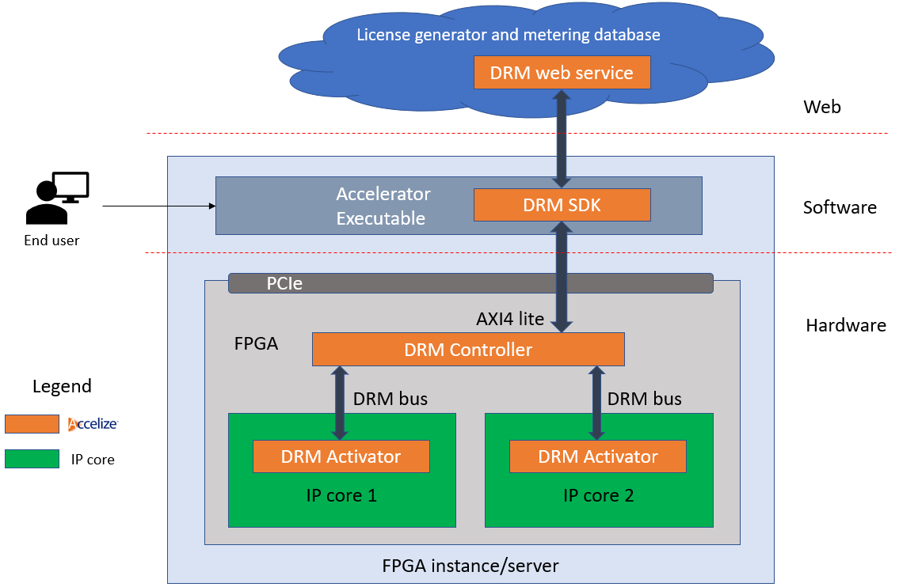

Accelize DRM
============

Overview
--------

The Accelize DRM is based on a licensing mechanism, where license keys including
activation codes are delivered to the FPGA to control the behavior of IP cores,
and where metering information is retrieved from the FPGA and stored in a
database to measure the usage of all IP cores. The metering information is
then used to invoice end users.

The Accelize DRM is built upon 3 main entities:

* The DRM HDK: a set of dedicated hardware IPs used to instrument the
  targeted HW
* The DRM Library: a C/C++/Python library to communicate between the
  targeted DRM Hardware IP and the DRM web service
* The DRM Web service: a Web Service application with a database
  (cloud hosted or on premise)

Accelize operates the licensing/metering
service for your FPGA solution deployed in your public Cloud, private Cloud,
on-premise or hybrid multi-Cloud infrastructure. This allows you to implement
any business model securely. You then bill your customers according to their
usage reported to you by Accelize. The following table gives an overview of
business models supported by Accelize.

Licensing Modes
---------------

The Accelize DRM enables following licensing modes:

Metering, Data usage-based::
    Monetize your FPGA design / IP based on the data it processes
    (# of GBytes, # of frames, # of inferences, # of API calls, ...)

Metering, Time-based::
    Monetize your FPGA design / IP based on the operating time
    seconds, minutes, hours, days…)

Floating::
    Enable the use of X number of FPGA designs / IP's on a pool of FPGA boards
    in a hybrid cloud infrastructure (distributed across multiple public/private
    data centers)

Node locked::
    Deploy your FPGA design in the form of an *appliance* by assigning a
    license to a unique board id.

Technical description:

* The Metering mode where an Activation session is maintained with Floating
  Licenses and a License Timer as long as the DRM Controller delivers
  authenticated Metering Data blocks. The License Timer initialization value
  determines the duration of the current random seed value and so the activation
  validity period and the Metering Data collection frequency. When the License
  Timer exhausts, the DRM Controller deactivates the IP Cores until a valid
  License Timer value is reloaded. The DRM Web Service delivers a new valid
  License Timer value only if an authenticated Metering Data block is provided
  in the License request. This mechanism enforces a periodic Metering Data
  collection during the HW operations.
* The Floating mode where a stream of time-based License Keys per circuit is
  used to provide Activation Codes and Credit Timers to the Protected IPs.
  The License Keys generation is based on the Public Chip ID and a random
  seed generated at runtime after reset. The License Key cannot be provisioned
  and can be used only during the current runtime, the DRM Controller keeping
  the random seed value until the next reset.
* The Node Locked mode where a single License Key per circuit is used to provide
  Activation Codes to the Protected IPs. The License Key generation is based on
  the Public Chip ID. The License Key can be stored locally and reloaded at
  runtime whenever needed during the circuit lifecycle. The License Key can
  optionally contain a Credit timer value for each IP for temporary or demo
  licenses.

Glossary
--------

.. list-table::
   :header-rows: 1

   * - Word
     - Description
   * - **AC**
     - Activation Code
   * - **DRM**
     - Digital Rights Management
   * - **DNA**
     - A unique chip identifier; could be deliver by a PUF
   * - **PUF**
     - Physically Unclonable Function
   * - **VLVN**
     - Vendor Library Name Version
   * - **IP Core**
     - Functional block to be protected
   * - **Protected IP**
     - IP Core + DRM instrumentation
   * - **DRM Enabled IP**
     - a Protected IP
   * - **CDC**
     - Clock Domain Crossing
   * - **Credit Timer**
     - For Activation Duration controlled by the IP Activator, one per Protected IP

.. toctree::
   :maxdepth: 2
   :caption: Accelize DRM documentation

   drm_integration
   drm_configuration

.. toctree::
   :maxdepth: 2
   :caption: Accelize DRM components

   drm_hardware_ip_activator
   drm_hardware_ip_controller
   drm_library

.. toctree::
   :maxdepth: 2
   :caption: Links

   contacts
   Accelize Website <https://www.accelize.com>

Indices and tables
==================

* :ref:`genindex`
* :ref:`modindex`
* :ref:`search`

.. todo:: Replace "ACCOUNT_ID" by Google Analytics account ID in
          "_templates/layout.html"